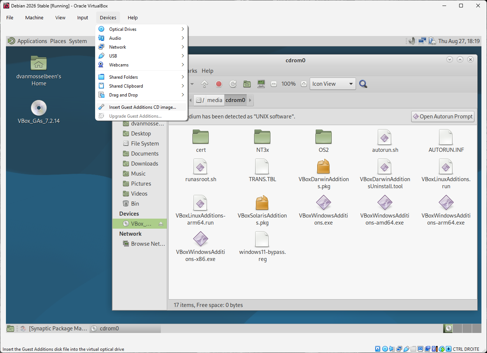

# Debian GNU / Linux

## About this document

This document will list a few notes about the [Debian GNU/Linux](https://www.debian.org) Operating System. It is mainly a draft document containing some notes or links to resources concerning `Debian`. This document won't detail everything as there are already a lot of documentation available online.


## Table of Contents

- [Introduction](#introduction)
- [General information](#general-information)
  - [Release (version)](#release-version)
- [Installing Debian](#installing-debian)
  - [Using Debian backports](#using-debian-backports)
  - [Migrating from stable to testing release](#migrating-from-stable-to-testing-release)
  - [Installing the testing version from scratch](#installing-the-testing-version-from-scratch)
  - [Install VirtualBox Guest Additions](#install-virtualbox-guest-additions)
- [The package manager](#the-package-manager)
  - [apt](#apt)
  - [aptitude](#aptitude)
- [Admin commands](#admin-commands)
  - [System](#system)
  - [Files](#files)
  - [Packages](#packagesk)
  - [Users and groups](#users-and-groups)
  - [Networking](#networking)
  - [LXD](#lxd)
- [Interesting packages](#interesting-packages)
  - [For Users](#for-users)
  - [For Administrators](#for-administrators)
- [Packages I install on each desktop](#packages-i-install-on-each-desktop)
- [Server tools](#server-tools)
  - [SSH Server](#ssh-server) 
  - [Web Server & Database](#web-server--database)
    - [Apache](#apache)
      - [Installing Apache](#installing-apache)
    - [MySQL](#mysql)
      - [Installing MySQL](#installing-mysql)
    - [PHPMyAdmin](#phpmyadmin)
- [Getting more help](#getting-more-help)
- [Resources](#resources)

## Introduction

The `Debian GNU/Linux` Operating System claims to be the universal operating system. And that is in fact true. `Debian` runs on older hardware as well as on modern hardware. It is able to run on a variety of different architectures. Up from computers, to tablets, dedicated hardware such as the `Raspberry Pi`, the `Sony Playstation 3` and so on. I guess we could install `Debian` into our fridge, but people seems to lazy to do so.

## General information

### Release (version)

`Debian` has been know to be a very stable Operating System. `Debian` is available in 3 different releases. A `stable` version, a `testing` version, and an `unstable` version (called `Sid`). The names of the different releases come from the `Toy Story` animation movies.

The `stable` version, like the name say it, is very stable, however, the packages (applications and libraries) are older than a normal user would expect. A stable version is release once in a while and the packages aren't updated anymore. Except for security patches. But you will never get new features on a stable version once it is release.

The `testing` version, like the name say it, is a testing version.

The `unstable` version (codename `Sid`), like the name say it, is an unstable version with the latest packages. This is only recommended being used if you really know what you are doing.

## Installing Debian

You can install `Debian` on different ways. Starting from a `CD`, `DVD`, `iso image`, `usb` key, with `PXE` boots and so on.

These days, with a big internet line, it's common to use the `netinst` method. Which is by using a little `iso` image. That `iso` image you can burn to a `CD` or `USB` and from there boot up your computer. The particularity of the `netinst` method is that the `iso` image is very small. The iso image contains the bare minimum to install a system. The additional software, if selected during the installation, will be downloaded and then installed on your computer. 

Go to the [official website of debian](https://www.debian.org/) to download the `ISO`.

**Flash the ISO**

Burn the downloaded `ISO` to a `USB` flash drive using a tool like `Etcher`, `Ventoy`, or the `dd` command line utility.

**Boot and Run the Installer**

1. Insert the `USB` into the target computer and boot into it via your system's `BIOS/UEFI` boot menu.
2. Select either `Graphical Install` or `Install` from the boot menu. 
3. Follow the on-screen prompts to configure your language, keyboard layout, and network settings. 
4. Partition your hard drive as prompted.
5. When the installer asks you to select a software mirror.
6. Choose your preferred Desktop Environment (like `GNOME`, `KDE Plasma`, or `XFCE`) and complete the installation

### Using Debian backports

The advantage of the `Debian Stable` release is that the packages are very stable and well tested, and normally you should not have any problems. This is perfect for servers. But due to that, the packages (applications) are very old. If you are a desktop user, the applications might be probably too old for you. And maybe you do not want to risk using the `Debian Testing` release. Then, the `Debian Backports` is a solution for you.

The `Debian Backports` simple offers more recent packages to the `Debian Stable` release, without breaking your system. So you can decide to install a specific, more recent package.

See <https://backports.debian.org/Instructions/> for the up-to-date instructions.

### Migrating from stable to testing release

Firstly, need to adjust the `/etc/apt/sources.list`. But we make a backup file of it first.

```commandline
sudo cp /etc/apt/sources.list /etc/apt/sources.list.BAK

sudo sed -i "s/stable/testing/" /etc/apt/sources.list
```

*Note: If your file explicitly uses a codename like `trixie`, replace stable with that codename in the command above.*

**Modify Security Repositories**

Ensure your security lines in the same `/etc/apt/sources.list` file are updated to point to the testing security branch. They typically look like this:

````editorconfig
deb http://debian.org testing-security main contrib non-free non-free-firmware
````

**Remove Incompatible Repositories**

Comment out or remove any repositories that are strictly tied to the `stable` release, such as `-backports` or `-updates`, by adding a `#` in front of them.

**Refresh Repositories and Perform the Upgrade**

Run the package update command to pull the new Testing catalog, then run a full system upgrade:

Now we are ready to upgrade the system:

```commandline
sudo apt-get update
sudo apt-get full-upgrade
```

*(Note: Use `full-upgrade` or `dist-upgrade` instead of a standard `upgrade` to ensure `apt` safely handles changing dependencies and removes obsolete packages).*

**Restart the Machine**

Once the download and installation complete, reboot your system to initialize the new kernel and system libraries:

````commandline
sudo reboot
````

### Installing the testing version from scratch

If you do not want to install `Stable` first, you can use the installer built specifically for the development cycle.

**Download the Installer**

Go to the official [Debian-Installer Page](https://www.debian.org/devel/debian-installer/). Under the "Daily builds" section, download the `ISO` image appropriate for your system architecture (most modern PCs will use `amd64`). The `netinst` (network installer) image is ideal as it downloads the freshest packages directly during setup.

**Flash the ISO**

Burn the downloaded `ISO` to a `USB` flash drive using a tool like `Etcher`, `Ventoy`, or the `dd` command line utility.

**Boot and Run the Installer**

1. Insert the `USB` into the target computer and boot into it via your system's `BIOS/UEFI` boot menu.
2. Select either `Graphical Install` or `Install` from the boot menu.
3. Follow the on-screen prompts to configure your language, keyboard layout, and network settings.
4. Partition your hard drive as prompted.
5. When the installer asks you to select a software mirror, it will automatically default to pointing towards the Testing repositories.
6. Choose your preferred Desktop Environment (like `GNOME`, `KDE Plasma`, or `XFCE`) and complete the installation

### Install VirtualBox Guest Additions

Installing the `VirtualBox Guest Addons` is not mandatory but really a big nice additional and very recommended. It allows a few extra features. Most important one is probably the ability to resize the screen of the window of the virtual machine size which affect the resolution of the virtual machine. But not only limited to that, there are other additional addons.

````commandline
sudo apt update
sudo apt install build-essential dkms linux-headers-$(uname -r)
````

From the virtual machine menu, `click Devices` -> `Insert Guest Additions CD Image` as shown on the image below:



*The screenshot also shows the File Manager with the content of the CD ROM that got automatically mounted.*

If you get an error saying the guest system has no ``CD-ROM``, stop the virtual machine, open the machine settings. Go to the `Storage` tab and add a new ``CD-ROM`` device by clicking on the plus sign (Adds optical device). Once done reboot the virtual machine.

Open the Debian guest terminal, create a new directory , and mount the ISO file:

````commandline
sudo mkdir -p /mnt/cdrom
sudo mount /dev/cdrom /mnt/cdrom
````

Navigate to the directory and execute the `VBoxLinuxAdditions.run` script to install the Guest Additions:

````commandline
cd /mnt/cdrom
sudo sh ./VBoxLinuxAdditions.run --nox11
````

Normally with `Debian version 13` you do not need to reboot anymore. Otherwise reboot the `Debian` guest for changes to take effect:

````commandline
sudo shutdown -r now
````

Once the virtual machine is booted, log into it and verify that the installation was successful and the kernel module is loaded using the `lsmod` command:

````commandline
lsmod | grep vboxguest
````

The output will look something like this:

````commandline
vboxguest             348160  2 vboxsfCopy
````

If the command does not return any output, it means that the VirtualBox kernel module is not loaded.

That’s it. You have installed `VirtualBox Guest Additions` on your Debian guest machine.

You can now enable Shared clipboard and Drag’n Drop support from the virtual machine settings `Storage` tab, enable 3D acceleration from the `Display` tab, create Shared folders, and more.

## The package manager

You can easily manage your package with the `apt` tools, which is a collection of tools including `apt-get`, `apt-cache` etc.

There's also `aptitude` which I strongly recommend but is not so user-friendly at all. If you don't want to bother, `apt` is just fine, and you don't need `aptitude`. Beside `apt` and `aptitude`, theirs an un numerous number of other applications, command line or with a graphical interface like for example `synaptic`.

### The apt tools

`apt-get` is the default package manager on `Debian`. There are other package managers available such as `aptitude` etc. but in this section we will try to show you how much `apt` rules!

Before searching or installing anything with `apt-get`, we need to retrieve its new list of packages:

```commandline
sudo apt-get update
```

Searching for applications:

```commandline
apt-get search gvim
```

Show more information about a package:

```commandline
apt-cache show gvim-gtk3
```

Installing applications:

```commandline
sudo apt-get install gvim-gtk3
```

Cleanup maintenance:

```commandline
# Clear the cache (Clears the downloaded deb files).
sudo apt-get clean

# Clears up, remove packages that where installed by other packages but are not used anymore
sudo apt autoremove
```

### aptitude

`Aptitude` can be used in 2 different ways. Both ways are to do on the command line but one method has no `UI` and the other has one.

Just by running the command `aptitude`, you will start the `UI` interface.

## Admin commands

A few common system commands:

### System

| Command                           | Description                                                           |
|-----------------------------------|-----------------------------------------------------------------------|
| `uname - a`                       | Display all system information.                                       |
| `hostnamectl`                     | Show current hostname and related details.                            |
| `lscpu`                           | Lists CPU architecture information.                                   |
| `timedatectl status`              | Shows system time.                                                    |
| `top`                             | Displays real-time system processes.                                  |
| `htop`                            | An interactive process viewer (needs installation).                   |
| `df -h`                           | Show disk usage in a human-readable format.                           |
| `free -m`                         | Displays free and used memory in MB.                                  |
| `kill <process id>`               | Terminates a process.                                                 |
| `[command] &`                     | Runs command in the background.                                       |
| `jobs`                            | Displays background jobs.                                             |
| `fg <command number>`             | Brings command to the foreground.                                     |
| `sudo systemctl start <service>`  | Starts a service.                                                     |
| `sudo systemctl stop <service>`   | Stop a service.                                                       |
| `sudo systemctl status <service>` | Checks the status of a service.                                       |
| `sudo systemctl reload <service>` | Reloads a service's configuration without interrupting its operation. |
| `sudo service <service> status`   | To check if service is been running.                                  |
| `sudo shutdown -h now`            | Shutdown the computer now.                                            |
| `sudo reboot`                     | Reboot the computer now.                                              |
| `journalctl -f`                   | Follows the journal, showing new log messages in real time.           |
| `journalctl -u <unit_name>`       | Displays logs for a specific system unit.                             |
| Shows some logs on the console.   | Shows some logs on the console.                                       |
| `crontab -e`                      | Edits cron jobs for the current user.                                 |
| `crontab -l`                      | List cron jobs for the current user.                                  |
|                                   |                                                                       |

### Files

| Command                                                 | Description                                                                                               |
|---------------------------------------------------------|-----------------------------------------------------------------------------------------------------------|
| `ls`                                                    | List files and directories.                                                                               |
| `touch <filename>`                                      | Creates an empty file or updates the last accessed date.                                                  |
| `cp <source> <destination>`                             | Copies files from source to destination.                                                                  |
| `mv <sources> <destination>`                            | Moves files or renames them.                                                                              |
| `rm <filename>`                                         | Deletes a file.                                                                                           |
| `pwd`                                                   | Display the current directory path.                                                                       |
| `cd <directory>`                                        | Changes the current directory.                                                                            |
| `mkdir <dirname>`                                       | Creates a new directory.                                                                                  |
| `chmod [who][+/-][permission] <file>`                   | Changes file permissions.                                                                                 |
| `chmod u+x <file>`                                      | Makes a file executable by its owner.                                                                     |
| `chmod [user]:[group] <file>`                           | Changes file owner and group.                                                                             |
| `find [directory] -name <search_patter>`                | Finds files and directories.                                                                              |
| `grep <search_patter> <file>`                           | Searches for a pattern in files.                                                                          |
| `tar -czvf <name.tar.gz> [files]`                       | Compresses files into a tar.gz archive.                                                                   |
| `tar -xvf <name.tar.[gz] or [bz] or [xz] [destination]` | Extract a compressed tar archive.                                                                         |
| `nano [file]`                                           | Opens a file in the Nano text editor.                                                                     |
| `cat <file>`                                            | Displays the contents of a file.                                                                          |
| `less <file>`                                           | Displays the paginated content of a file.                                                                 |
| `head <file>`                                           | Shows the first few lines of a file.                                                                      |
| `tail <file>`                                           | Shows the last few lines of a file.                                                                       |
| `awk ´{print}´ [file]`                                  | Prints every line in a file.                                                                              |
| `wich <package>`                                        | Return the location of the file.                                                                          |
| `stats`                                                 | Gives information about a given file. Like the permissions but also the access, modify and creation time. |

### Packages

| Command                                | Description                                                                           |
|----------------------------------------|---------------------------------------------------------------------------------------|
| `sudo apt install <package>`           | Install a package.                                                                    |
| `sudo apt -f -reinstall <packagename>` | Reinstall a broken package.                                                           |
| `sudo apt search <pakage>`             | Search for APT packages.                                                              |
| `sudo apt-cache policy <pakage>`       | Lists available package versions.                                                     |
| `sudo apt update`                      | Updates packages lists.                                                               |
| `apt list --upgradable`                | List packages that can be upgraded.                                                   |
| `sudo apt upgrade`                     | Upgrades all upgradable packages.                                                     |
| `sudo apt dist-upgrade`                | Upgrades safely all upgradable packages.                                              |
| `sudo apt remove <package>`            | Remove a package.                                                                     |
| `sudo apt purge <package>`             | Removes a package and all its configuration files.                                    |
| `apt-get -f install`                   | Force install a package.                                                              |
| `sudo dpkg -l <package>`               | List if package is installed.                                                         |
| `sudo dpkg -L <package>`               | Show the content of a deb package.                                                    |
| `sudo apt clean`                       | Remove downloaded packages which are stored in `/var/cache/apt/archives`              |
| `sudo apt autoremove`                  | Removes packages that where installed by other packages and that aren't used anymore. |
| `snap find <package>`                  | Search for Snap packages.                                                             |
| `sudo snap install <snap_name>`        | Installs a Snap package.                                                              |
| `sudo snap remove <snap_name>`         | Removes a Snap package.                                                               |
| `sudo snap refresh`                    | Updates all installed Sna packages.                                                   |
| `snap list`                            | Lists all installed Snap packages.                                                    |
| `snap info <snap_name>`                | Displays information about a Snap package.                                            |

### Users and groups

| Command                     | Description                                  |
|-----------------------------|----------------------------------------------|
| `w`                         | Shows which users are logged in.             |
| `sudo adduser <username>`   | Creates a new user.                          |
| `sudo deluser <username>`   | Deletes a user.                              |
| `sudo passwd <username>`    | Sets or changes the password for a new user. |
| `su <username>`             | Switches user.                               |
| `sudo passwd -l <username>` | Locks a user account.                        |
| `sudo passwd -u <username>` | Unlocks a user password.                     |
| `sudo change <username>`    | Sets user password expiration date.          |
| `id [username]`             | Displays user and group IDs.                 |
| `groups [username]`         | Shows the groups a user belongs to.          |
| `sudo addgroup <groupname>` | Creates a new group.                         |
| `sudo delgroup <groupname>` | Delete a group.                              |

### Networking

| Command                                     | Description                                         |
|---------------------------------------------|-----------------------------------------------------|
| `ip addr show`                              | Displays network interfaces and IP addresses.       |
| `ip -s link`                                | Shows network statistics.                           |
| `ss -l`                                     | Shows listening sockets.                            |
| `ping <host>`                               | Pings a host and outputs results.                   |
| `cat /etc/netplan/*.yaml`                   | Displays the current Netplan Configuration.         |
| `sudo netplan try`                          | Tests a new configuration for a set period of time. |
| `sudo netplan apply`                        | Applies the current Netplan configuration.          |
| `sudo ufw status`                           | Displays the status of the firewall.                |
| `sudo ufw enable`                           | Enable the firewall.                                |
| `sudo ufw disable`                          | Disable the firewall.                               |
| `sudo ufw allow <port/service>`             | Allows traffic on a specific port or service.       |
| `sudo ufw deny <port/service>`              | Denies traffic on a specific port or service.       |
| `sudo ufw delete allow/deny <port/service>` | Deletes an existing rule.                           |
| `ssh <user@host>`                           | Connects to a remote host via SSH.                  |
| `scp <source> <user@host>:<destination>`    | Securely copies files between hosts.                |

### LXD

| Command                                                         | Description                                              | 
|-----------------------------------------------------------------|----------------------------------------------------------|
| `lxd init`                                                      | Initializes LXD before first use.                        |
| `lxc init ubuntu:22.04 <container name>`                        | Creates a lxc system container (without starting it).    |
| `lxc launcher ubuntu:22.04 <container name>`                    | Creates and starts a lxc system container.               |
| `lxc launch ubuntu22.04 <vm name> --vm`                         | Creates and starts a virtual machine.                    |
| `lxc list`                                                      | Lists instances.                                         |
| `lxc info <instance>`                                           | Shows status information about an instance.              |
| `lxc start <instance>`                                          | Starts an instance.                                      |
| `lxc stop <instance> [--force]`                                 | Stops an instance.                                       |
| `lxc delete <instance> [--force] [--interactive]`               | Deletes an instance.                                     |
| `lxc exec <instance> -- <command>`                              | Runs a command inside an instance.                       |
| `lxc exec <instance> -- bash`                                   | Gets shell access to an instance (if bash is installed). |
| `lxc console <instance> [flags]`                                | Gets console access to an instance.                      |
| `lxc file pull <instance>/<instance_filepath> <local_filepath>` | Pulls a file from an instance.                           |
| `lsc file pull <local_filepath> <instance>/<instance_filepath>` | Pushes a file to an instance.                            |
| `lxc project create <project> [--config <option>]`              | Create a project.                                        |
| `lxc project set <project> <option>`                            | Configure a project.                                     |
| `lxc project switch <project>`                                  | Switches to a project.                                   |

## Interesting packages

A few very interesting package:

### For users

| Application       | Description                                                                                                                                                                                                                         |
|-------------------|-------------------------------------------------------------------------------------------------------------------------------------------------------------------------------------------------------------------------------------|
| `screen`          | See the dedicated [screen](../Tools/screen.md) page. But you probably want to look for the `tmux` tool                                                                                                                              |
| `tmux`            | See the dedicated [tmux](../Tools/tmux.md) page. More newer and probably better than `screen`.                                                                                                                                      |
| `mc`              | Midnight Commander - a powerful file manager                                                                                                                                                                                        |
| `irssi`           | The ultimate irc chat client, of course command line only. But irssi is really some awesome IRC command line application. You won't find anything better. If so, mail me please! See the dedicated [irssi](../Tools/irssi.md) page. |
| `xclip`           | command line interface to X selections                                                                                                                                                                                              |
| `mutt`            | text-based mailreader supporting MIME, GPG, PGP and threading                                                                                                                                                                       |
| `sqlitebrowser`   | GUI editor for SQLite databases                                                                                                                                                                                                     |
| `vim`             | Vi IMproved - enhanced vi editor. See the dedicated [vim](../Tools/vim.md) page.                                                                                                                                                    |
| `vim-gtk3`        | Vi IMproved - enhanced vi editor - with GTK3 GUI                                                                                                                                                                                    |
| `vim-python-jedi` | autocompletion tool for Python - VIM addon files                                                                                                                                                                                    |
| `unp`             | unpack (almost) everything with one command                                                                                                                                                                                         |
| `fastfetch`       | neofetch-like tool for fetching system information                                                                                                                                                                                  |


### For Administrators

| Application           | Description                                                                                                                           |
|-----------------------|---------------------------------------------------------------------------------------------------------------------------------------|
| `aptitude`            | Package manager                                                                                                                       |
| `apt-listchanges`     | List the changes...                                                                                                                   |
| `apt-listbugs`        | tool which lists critical bugs before each APT installation                                                                           |
| `apt-reportbug`       | reports bugs in the Debian distribution                                                                                               |
| `net-tools`           | Contains essential networking tools such as arp, ifconfig, netstat, route and more.                                                   |
| `htop`                | interactive processes viewer                                                                                                          |
| `iftop`               | Observe the flows on your network interfaces                                                                                          |
| `tightvncserver`      | virtual network computing server software                                                                                             |
| `fail2ban`            | Some security tools that watch the (abusive) login attempts and take action. See the dedicated [fail2ban](../Tools/fail2ban.md) page. |
| `rsnapshot`           | local and remote filesystem snapshot utility. A backup system. See the dedicated [rsnapshot](../Tools/rsnapshot.md) page.             |
| `uptimed`             | daemon to track uptimes, especially the high ones                                                                                     |
| `mydumper`            | High-performance MySQL backup tool                                                                                                    |
| `sqlitebrowser`       | GUI editor for SQLite databases                                                                                                       |
| `unattended-upgrades` | automatic installation of security upgrades                                                                                           |
| `fastfetch`           | neofetch-like tool for fetching system information                                                                                    |
| `pyroman`             | Very fast firewall configuration tool                                                                                                 |
| `shorewall`           | Shoreline Firewall, netfilter configurator                                                                                            |

## Packages I install on each desktop

Apps I install on almost all of my desktops.

```
fail2ban
fastfetch
htop
irssi
mc
mutt
net-tools
openssh-server
rsnapshot
tmux
unp
uptimed
xclip
```

## Server tools

Here's a few tips for server tools.

### SSH Server

See the dedicated [ssh](../Tools/ssh.md) page for more information.

### Web Server & Database

There are various different web servers.

#### Apache 2

`Apache` is probably the most well know and used web server. It is very stable, very easy to use and to extend. There's also a lot of extra modules you can load to add some extra functionalities. In fact, if you need a good web server, then you are probably looking for this Apache web server.

See the dedicated [apache 2](../Tools/apache2.md) page for more information.

#### MySQL

See the dedicated [MySQL](../../../Databases/MySQL.md) page for more information.

#### PostgreSQL

See the dedicated [PostgreSQL](../../../Databases/PostgreSQL.md) page for more information.

#### PHPMyAdmin

`PHPMyAdmin` is a web interface to manage the `MySQL` databases. It's very handy and a must-have if you use MySQL.

## Getting more help

The trick on a `GNU/Linux` system is to find your way on how you should find information.

You can try to look to what files have been installed with the concerned application:

```commandline
dpkg -L <packagename>
```

Before adding a new user, look on how you should do:

```commandline
man adduser
```

## Resources

| Website                              | Description                                                    |
|--------------------------------------|----------------------------------------------------------------|
| <https://www.debian.org>             | The official website of the Debian GNU/Linux operating system. |
| <https://wiki.debian.org>            | The official wiki of Debian.                                   |
| <https://debian-handbook.info>       | The famous handbook for Debian.                                |
| <https://www.debianhelp.co.uk/>      | Some website with a lot of tutorials.                          |
| <https:www.debiantutorials.com>      | Website with tons of how to's.                                 |
| <https:www.debiantalk.wordpress.com> | Some blog with topics about Debian.                            |
| <https://debian.chezrami.net>        | Some French website with articles in french.                   |
| <https://www.debianadmin.com/>       ||

