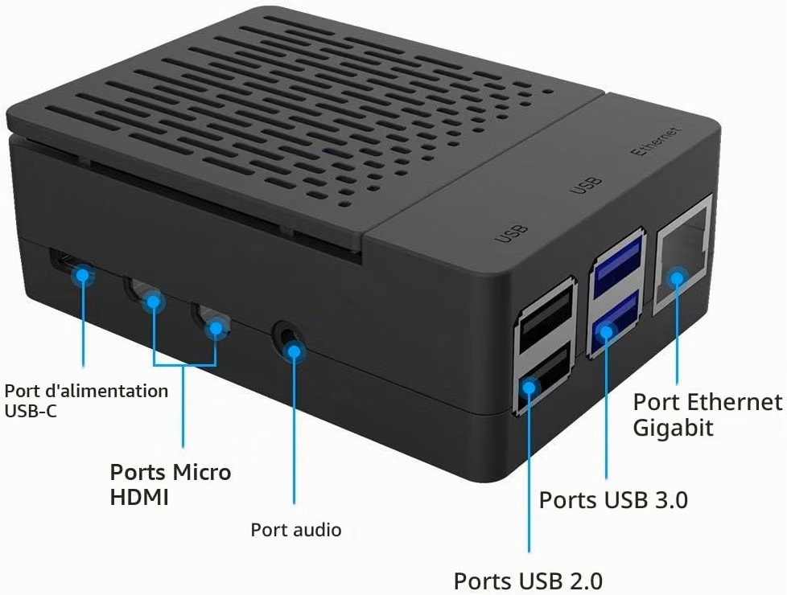
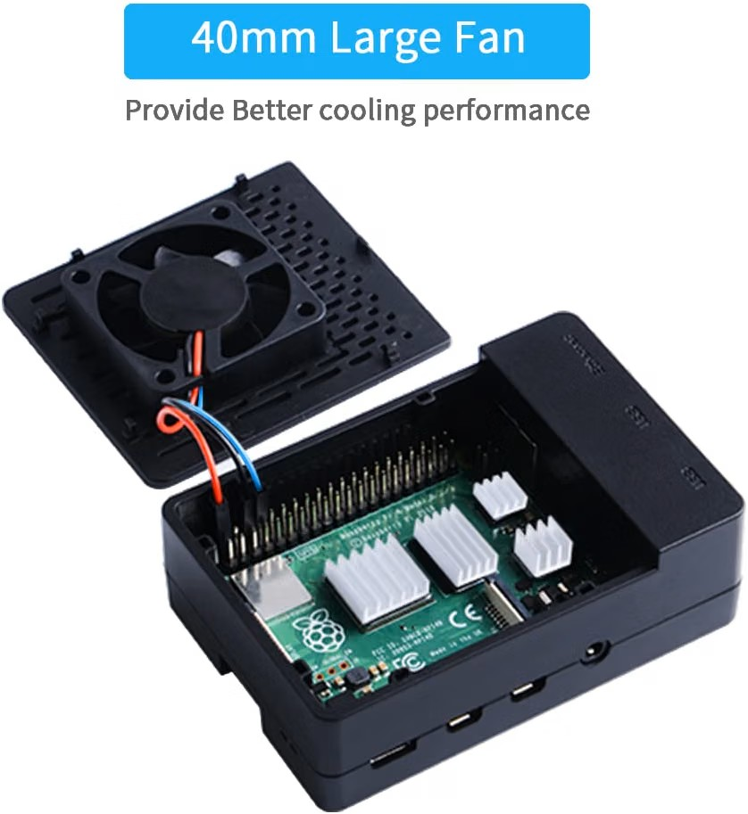
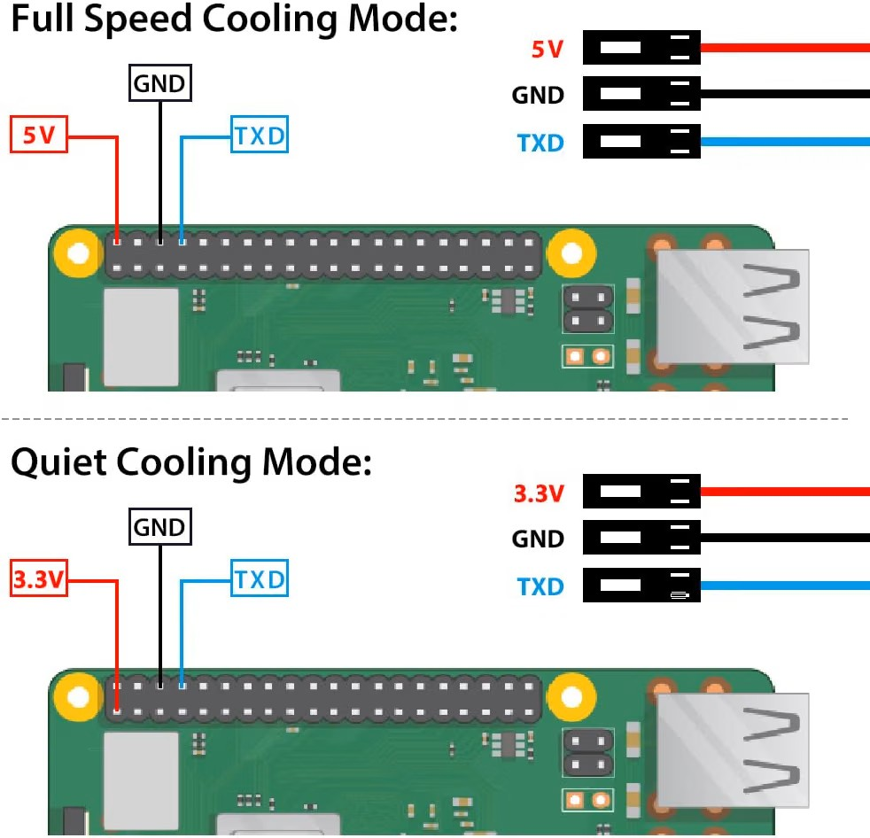
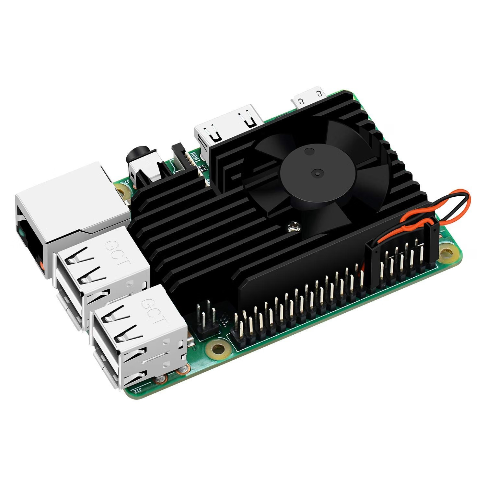
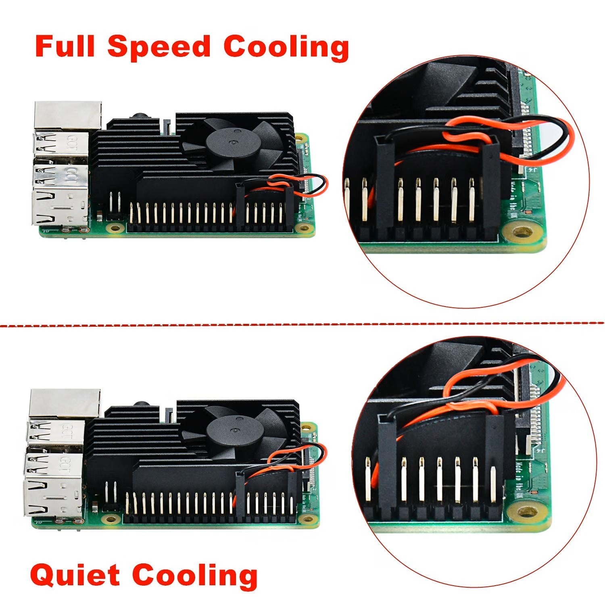

# Raspberry PI

## Table of Contents

- [Introduction](#introduction)
- [Installing an operating system on Raspberry Pi](#installing-an-operating-system-on-raspberry-pi)
- [Backing up the micro SD card](#backing-up-the-micro-sd-card)
- [Differences between Raspberry Pi models](#differences-between-raspberry-pi-models)
- [Things specific to Raspberry Pi](#things-specific-to-raspberry-pi)
  - [Raspbian specific tools](#raspbian-specific-tools)
  - [Touch screen](#touch-screen)
  - [STOP killing that SD card !](#stop-killing-that-sd-card-)
- [Using the Raspberry Pi Model 3 or 4 for the first time](#using-the-raspberry-model-3-or-4-for-the-first-time)
- [Updating the Raspberry Pi Operating System](#updating-the-raspberry-pi-operating-system)
- [Cleaning up stuff](#cleaning-up-stuff)
- [Recommended software and setup](#recommended-software-and-setup)
- [Recommended hardware for the Raspberry Pi](#recommended-hardware-for-the-raspberry-pi)
  - [Case and fan](#case-and-fan)
  - [Keyboard and Mouse](#keyboard-and-mouse)
  - [Screen](#screen)
- [Gathering information of the Raspberry Pi](#gathering-information-of-the-raspberry-pi)
  - [Temperature](#temperature)
  - [Other vcgencmd information](#other-vcgencmd-information)
- [Tools to take remote control](#tools-to-take-remote-control)
- [Migrations logs](#migrations-logs)
  - [Jessie to Buster migration](#jessie-to-buster-migration)
- [Other notes not categorised](#other-notes-not-categorised)
- [Projects](#projects)
- [TODO](#todo)
- [Resources](#resources)

## Introduction

This document is specific for the `Raspberry Pi Model 3B` or newer. I own both `Model 3B` and `Model 4`. Later on maybe there will be some more notes about some other versions of `Raspberry Pi`.

The `Raspberry Pi` is some minimalistic computer, the size of a bank card. Well, at least that's what they are saying about `Raspberry Pi` and which isn't 100% a lie. Because the ``Raspberry Pi`` is effectively that small. But then we are talking about the motherboard only. Once you put some protective case around it, that `Raspberry Pi` won't fit in your pocket so easily anymore. Besides, `Raspberry Pi` still is that small and awesome.

`Raspberry Pi` is something useless, something you don't need at all. You have no need to buy a ``Raspberry Pi`` because this will bring nothing good at home. `Raspberry Pi` will give you a lot of issues with your girlfriend. `Raspberry Pi` is just a big gadget, but then for geeks. It's just some stuff where you will spend tons of time with it. This toy is definitely not good for your social contacts. This mini computer is made for people who want to learn and play with computers. It's a little gadget running `Raspberry Pi Operating System`, a deviation of `Debian GNU / Linux`, the `Universal Operating System`. Although you can install a variety of other operating systems adapted for the `Raspberry Pi` architecture. For example there is an `Ubuntu` version for `Raspberry Pi`, but also many others like dedicated Operating Systems with a ready to use and full setup of game emulators.

Unfortunately, ``Raspberry Pi`` isn't powerful at all, it's slow compared to traditional computers. There's not much disk space available because it runs on that (provided) 16 GB `Micro SD` card. The hardware is really limited, you can't upgrade it really and expect some fancy other gadgets. Don't mind adding `RAM`, there's no way to do so!. You can't upgrade it a lot. The `Micro SD` card will kick your face sooner or later because `Micro SD` cards have a limited amount of (survive) cycles. These life cycles is between `10.000` and `100.000` write cycles depending on the quality of the `Micro SD` card. Which sounds enormous, but it isn't at all for a daily desktop usage, let alone a server usage. You won't be able to make a super computer of this `Raspberry Pi` box. And worse, `Raspberry Pi` runs on the `armhf` architecture, which is even less common, even for the average experienced `GNU/Linux` user.

But still, `Raspberry Pi` is awesome! It's so nice to play on such a little computer and it's a very useful gadget. You won't really throw your money through your window by buying a `Raspberry Pi`, because it's worth any Euro of it, despite that it's slow, limited etc. You will enjoy every minute when you are playing with your gadget! Or you will hate it if you are the average `Microsoft Windows` user. 

`Raspberry Pi` isn't for the average user at all. With this I mean the average `Microsoft Windows` user. Because this little box come with a pre-installed Operating System called `Raspbian` (via `Noobs`), a variant of `Debian GNU/Linux`. So, you should have at least basic (read advanced) general `GNU/Linux` knowledge if you want to play on this tiny computer. Or at least, be prepared to learn a lot of new high-tech if you have no general `GNU / Linux` knowledge at all. Don't be afraid, a `GNU / linux` Operating System isn't complicated at all, it's just that you need to learn to use it, like you did several years with `Microsoft Windows`.

That said, if you are new to `GNU / Linux`, Welcome! But I really don't think that `Raspberry Pi` is the ideal step to take if you want to learn `GNU / Linux`. My personal opinion would say you to install `Virtual Box` (or any virtualization software) and play with virtual machines instead. You should realise that a `Raspberry Pi` is really tin in all aspects. So, to avoid that you blame that `GNU / Linux` is slow, it's better that you move on to something more serious before digging into complex stuff. However, if you are patient, realist and have a fever to learn, go go go!!! Actually, `Raspberry Pi` can be the reason to start digging very deep in the `GNU / Linux` world. It could be also the start of a new hobby and who know, later, lead to a professional carrier in the computer sector.

As `Debian` is installed (on that `Micro SD` card), using `Raspberry Pi` is like using `Debian`. So in this document we will avoid to give general `Debian` information, rather point out that there's a [dedicated Debian documentation page](../Debian/Debian%20GNU%20Linux.md) for that. Here we will point out the things specific to the `Raspberry Pi` "computer".

## Installing an Operating System on Raspberry Pi

There are different methods to install and different variants of `GNU / Linux Operating` Systems you can install on the `Raspberry Pi`. For example the traditional and classing `Raspberry Pi` Operating System, `Ubuntu`, but even dedicated and ready to install Multimedia Server, game emulator consoles, Home automations and more.

### Installing the Operating System on the SD Card

There's some dedicated tool called `Raspberry Pi Imager` to use to download and prepare the `SD card`. For this see the website: <https://www.raspberrypi.org/downloads/>.

Once this tool installed on your `Microsoft Windows` or a `GNU / Linux` computer, it allows with a `GUI` interface to select the desired Operating System and to write it to the SD card. Once installed, start the Launcher and follows the instructions on screen, it's very easy.

### Installing the Operating System with the NetInstall method

If you have a `Raspberry Pi 4 Model B` or newer, then you can do a `NetInstall` even without a `SD Card`. This will then download the required installation files through the internet. This is only possible to do on the `RJ45` on not the Wi-Fi.

For this, you need to be sure that the firmware on the `Raspberry Pi` motherboard is up-to-date. At the time I had bought my different `Raspberry 4 Model B`, this was not yet possible. So I had to update the firmware and for this we need a running `Raspbian OS` running. And if you need to update the firmware, then I strongly recommend to make at least 1 installation on a `Micro SD` card, so that you always have a resque system by hand.

To start the `NetInstall` during the boot of the `Raspberry Pi`, it depend on the configuration of the bootloader. In 1 configuration it will always show up the boot option on screen, while the other configuration will request you keep `Shift` key pressed while booting up.

But for sure, if the `Raspberry Pi 4 Model B` or higher does not find a way to boot, then the `NetInstall` interface will automatically start.

Once the `NetInstall` started, just follow the instructions on screen. The steps are not covered here because it's very easy, and I guess it's prone to get updated frequently. And yes, from within the `NetInstall`, you can also install different variations of `OS` for you `Raspberry Pi`. It's the same as if you were using the `Raspberry Pi Imager`.

## Backing up the micro SD card

Once you have installed and configured a bare `Raspberry Pi`, it's strongly recommended of making a backup of the `Micro SD` card. This will speed up the process during a restore. As you should not forget, `Micro SD` cards die fast.

There are various ways to back up a system. But if in this case, the `Raspberry Pi` is stored on a `Micro SD` card, it's a matter to remove the `Micro SD` card and to copy the content of it to another `Micro SD` card or other storage.

On `Microsoft Windows 10` you can use the tool called `Win32 Disk Imager` from here: <https://sourceforge.net/projects/win32diskimager/>. The interface is very intuitive, and it's usage isn't detailed here.

Note, depending on the speed of the `Micro SD` card, as well as the card reader, it can take a while to back up a `Micro SD` card. Close to 1 hour.

 - There is also: <https://www.balena.io/etcher/>

## Differences between Raspberry Pi models

 - Note that there are different revisions of the `Raspberry Pi 4 Model B`. I have 2 different revisions of the `4th` generation, and the CPU speed is different. One is `BCM2711 (4) @ 1.50 GHz` (has `4GB RAM`) and the other `BCM2711 (4) @ 1.80 GHz` (has `8GB RAM`). The `8GB RAM` was released at a later time to the public. From what I understood, now all the newer `Raspberry Pi 4 Model B` are at `1.8GHz`.
 - The cases of the `Raspberry Pi 3` is not compatible with `Model 4` as well as the `Model 5` are all different. It's mainly due the ports not at the same places.

`CPU` Specific information:

| Raspberry Pi Model        | CPU Used                            |
|---------------------------|-------------------------------------|
| Raspberry Pi 1B           | 1× ARM1176JZF-S 700 MHz             |
| Raspberry Pi 2B           | 4× Cortex-A53 900 MHz               |
| Raspberry Pi 3B+          | 4× Cortex-A53 1.4 GHz               |
| Raspberry Pi 4B           | 4× Cortex-A72 1.5 GHz (or 1.8 GHz)  |
| Raspberry Pi 5            | 4× Cortex-A76 2.4 GHz               |

`GPU` Specific information:

| Raspberry Pi Model        | GPU                                                    |
|---------------------------|--------------------------------------------------------|
| Raspberry Pi 1, 2 and 3   | Broadcom VideoCore IV @ 250 MHz                        |
| Raspberry Pi 3B+          | Broadcom VideoCore IV @ 400 MHz (Core) / 300 MHz (V3D) |
| Raspberry Pi 4B           | Broadcom VideoCore VI @ 500 MHz                        |
| Raspberry Pi 5            | Broadcom VideoCore VII @ 800 MHz                       |

- See here for more information <https://raspberrytips.com/glossary/cpu/> and here <https://raspberrytips.com/glossary/gpu/>
- See also the comparison between the `Raspberry Pi 5` and `4` - <https://raspberrytips.com/raspberry-pi-5-vs-pi-4/>

## Things specific to Raspberry Pi

- On old versions, the default password for the `pi` user account is `raspberry`. There's no password set for the `root` user and to get `root` access you should use the `sudo` command. Thus, to pass to a `root shell`, from the `pi` user account you should type this: `sudo su`. You will switch to the `root` user without being asked for the `root` password, because there's none. From there, you can define a password if desired with the `passwd` command, which I strongly recommend.

- The `Raspberry Pi` I have bought came with a `Micro SD` card with `Raspberry` (`Debian`) pre-installed. If you know about the `Debian GNU/Linux` operating system, or any other `GNU/Linux` distribution based on `Debian`, then you will find your way.

### Raspbian specific tools

| Command      | Description                                                                          |
|--------------|--------------------------------------------------------------------------------------|
| `raspi-config` | Raspberry Pi configuration tool                                                      |
| `raspi-gpio`   | Dump the state of the BCM270x GPIOs                                                  |
| `raspinfo`     | Gives a lot of information of the `Raspberry Pi` system and what is connected to it. |
| `raspistill`   |                                                                                      |
| `raspivid`     |                                                                                      |
| `raspividyuv`  |                                                                                      |
| `raspiyuv`     |                                                                                      |
| `vcgencmd`     | Gather different system information like temperatures, CPU speed, trothling.         |

### Touch screen

It's common to connect a touch screen to a `Raspberry Pi`, for this you will probably want to install the package `squeekboard` to have an On-screen keyboard. There are many on-screen keyboards app available ready to install but this package seems to be the default to use if you installed the desktop version of `Raspberry Pi`. It supports the `Wayland` and support the `input-method`, `text-input` and `virtual-keyboard` protocols. `squeekboard` is primarily build for mobile devices such as phones and tablets. 

On portrait screens, for example a `14 inch`, I do not find `squeekboard` handy, as it take too much space and there seems no easy way to make the on-screen keyboard smaller or make it disappear (minimalize) when we do not need the on-screen keyboard anymore. For example if there is some input field, and you click with the mouse on it to set the cursor inside, the on-screen keyboard show up and take literally half of the screen. The app has to resize or half of it is hidden under the on-screen keyboard. And there's no easy way to minimalize, with an on-screen button or so, the keyboard from the screen.

### STOP killing that SD card !

Yes! Stop with that! Please!

Seriously, SD cards have a limited time of life, a limited amount of read and write lifetime. What does that mean? In other words, that SD cards aren't made to be used "extensively" (read, not that extensively at all) and that your SD card will die sooner than expected! Really sooner than expected! How so? Like said, SD cards aren't made for these purposes and in 1,2,3 you will reach the end of life of you SD card.

You still don't believe me? Install apache and let the default configuration kill your SD card in less than 6 months. Assuming you get only a very less visitors, otherwise you will kill your SD card much faster!

But heck, how can I save my SD card ? 

Well, don't use it, and it will last (almost) forever.

Seriously, you should take into consideration that any read / write to your SD card, will improve his time left to die. So, generally speaking, you should avoid useless reads and writes to you hard disk drive, ahum, your SD card.

You should do the maximum with your `Raspberry Pi` system to write as less than possible to it's hard disk drive (which is SD). So for instance, if you want to run a webserver, or anything that log (write a lot to your hard disk drive), should be avoided. Or at least, you should change the configuration settings so that it log as less than possible. In fact, you should deactivate as much as possible to log (read this as; read and write).

"Wait, you are asking me to deactivate the logs on my `Raspberry Pi`?"

Yes, because of: Do you read your logs ? If yes, do you read them before it's too late ? If still yes, why are you losing your time reading this, you are probably aware of all that high-tech that fails ...

Like i said before, `Raspberry Pi` is a gadget, no offence meant, but you should be aware that you are playing and dealing with some complex stuff. So you should deal with its limitation, well, the technology limitation. After all, it's not the fault of Raspberry that (on hardware side) SD cards just sucks (tm).

But don't worry too much, there are solutions like mentioned above ! So, stop using your Raspberry, and it won't kill your expensive SD card !

As alternative, you can look to install `Noobs` (read, raspbian) to an external hard disk drive. Yes, you read it good, install it to another "hard disk" than your SD card. With one stone, you will hit 2 targets. Using raspberry with an external (powered over USB, instead of a wall plug), you will avoid killing your SD card within a few months. But the most "visible" improvement would be visible when seeing that the boot up & co is much faster on an external drive that the SD card.

## Using the Raspberry Model 3 or 4 for the first time

The first time you want to use the `Raspberry Pi` with the ready to use Operating System on the SD Card you bought with the `Raspberry Pi`, you probably need to plug in all cables so that you could configure it. Plug in all cables: hdmi, keyboard, mouse, power cable. The `Raspberry Pi` will automatically boot once you plugged in the power cable. There's no `On` or `Off` button. So the power cable is always the cable you want to plug at last.

Once booted you will get an interface `Welcome to the Raspberry Pi`, which request you to select your country, keyboard settings and more things. Just follow the step on the screen. Once this done, then it will do its updates. Updating the system can take a while. Once this done, he will request to reboot the system, which you should do.

Once this done, I recommend doing a few more things:

* Activate the `SSH` and `Remote Desktop Server`. For this, if you have a desktop running, go to the `Menu` > `Preferences` > `Raspberry Pi Configuration`. In that new window, select the tab `Interfaces` and check the options `SSH`, `VNC`. Or from the command line, use the app `raspi-config` and go in the menu: `Interface Options`, then activate there the `SSH` and `VNC` options.
* With `Raspberry Pi 4 Model B` with `4K` resolution screen setups, I strongly recommend enabling the `Display` > `Pixel Doubling` so that all things on the big `4K` screen is more readable.
* Change host name `System` > `Hostname`. I prefer to be more clear, so for me, it will be `raspberrypim3` or `raspberrypim4`. 

Once these settings adjusted, you need to reboot the system. After this, I suggest to start to make use of the remote tools like `ssh` or `RealVNC` to connect to your `Raspberry Pi`.

## Updating the Raspberry Pi Operating System

It's just a matter of using 2 commands, like any other `Debian` based `Linux` distribution.

````commandline
apt-get update
apg-get upgrade
````

## Cleaning up stuff

Note that you should run the following command once in a while if you fetch a lot of updates and install new software. But maybe first look with `df -h` how much diskspace is used, and after the cleanup check again.

````commandline
# Clear the cache (Clears the downloaded deb files).
apt-get clean
````

Also, to clean up the packages that are not used anymore:

````commandline
# Clears up, remove packages that where installed by other packages but are not used anymore
apt autoremove
````

After a fresh installation on a `Raspberry Pi 4 Model B`, I passed from `8.6G` to `6.7G`.

## Recommended software and setup

As `Raspberry Pi` OS is based on `Debian`, you will find all the classic programs. So you could also take a look to the dedicated [Debian](../Debian/Debian%20GNU%20Linux.md) page. But note that not all `Debian` packages are available for `Raspberry Pi`.

| Application      | Description                                                                                                                                                                                                                         |
|------------------|-------------------------------------------------------------------------------------------------------------------------------------------------------------------------------------------------------------------------------------|
| `openssh-server` | Open sshd server.                                                                                                                                                                                                                   |
| `tmux`           | See the dedicated [tmux](../Tools/tmux.md) page.                                                                                                                                                                                    |
| `htop`           | interactive processes viewer                                                                                                                                                                                                        |
| `iftop`          | Observe the flows on your network interfaces                                                                                                                                                                                        |
| `mc`             | Midnight Commander - a powerful file manager                                                                                                                                                                                        |
| `tightvncserver` | virtual network computing server software                                                                                                                                                                                           |
| `irssi`          | The ultimate irc chat client, of course command line only. But irssi is really some awesome IRC command line application. You won't find anything better. If so, mail me please! See the dedicated [irssi](../Tools/irssi.md) page. |
| `fail2ban`       | Some security tools that watch the (abusive) login attempts and take action. See the dedicated [fail2ban](../Tools/fail2ban.md) page.                                                                                               |
| `xclip`          | command line interface to X selections                                                                                                                                                                                              |
| `fastfetch`      | neofetch-like tool for fetching system information                                                                                                                                                                                  |
| `uptimed`        | daemon to track uptimes, especially the high ones                                                                                                                                                                                   |
| `unp`            | unpack (almost) everything with one command                                                                                                                                                                                         |
| `net-tools`      | ifconfig commands and all that.                                                                                                                                                                                                     |

## Recommended hardware for the Raspberry Pi

This section is probably more specific to personal taste, but at the same time tries to give objective advises.

### Case and fan

A fan is highly recommended on any `Raspberry Pi`, it's not mandatory, but still, it will keep your `Raspberry Pi` much cooler even at idle. 

The official red ad white case of `Raspberry Pi 3 & 4` is beautiful. But it does not have openings for aeration. So you will have a high average `CPU` temperature even at idle. Removing the upper cover, so that there is aeration will already drop the average temperature at idle for `10` degrees. But then all dust can get easy inside and the case isn't beautiful anymore.

#### GeeekPi PWM Case for Raspberry Pi 4 Model B, with Fan 40X40X10mm and 4pcs Raspberry Pi 4 Heatsinks (Black)

Bought this for `€11.99` on `Amazon`, [see here](https://www.amazon.com.be/dp/B07XCKNM8J?ref=ppx_yo2ov_dt_b_fed_asin_title).

I use this case for a `Raspberry Pi 4 model B with 4 GB RAM`. It's the older generation of `Raspberry Pi` and the CPU speed is `1.5 GHz`. I use this case to replace the official red and white `Raspberry` case. Because with the official case, the average idle temperature was `61.3°` in a room with ambient temperature of `20.3°` which is quite high already. With this case, the average idle temperature dropped from `61.3` to `32.6°` which is `28.7°` less. So this is a very nice improvement. When the CPU is under intensive load, the temperature will stay reasonable. The fan is connected on the `5V` pin, so it stays in `Full Speed Cooling mode`.







#### GeeekPi Raspberry Pi 4 Aluminum Fan Kit with Fan for Raspberry Pi 4B & Raspberry Pi 3B+3B

Bought this for `€10.99` on `Amazon`, [see here](https://www.amazon.com.be/dp/B07JGNF5F8?ref=ppx_yo2ov_dt_b_fed_asin_title).

I use this in a well aerated case with a `Raspberry Pi 4 with 8 GB RAM and CPU at 1.8 GHz`. The average idle temperature of the CPU is `55.0°` in a room with ambient temperature of `20.3°`. With this fan, the `CPU` now has an average of `39.4°` that is `16°` less. The fan is connected on the `5V` pin, so it stays in `Full Speed Cooling mode`.





The `Full Speed Cooling` is connected on the `5V` and the `Quit Cooling` on `3V`.

### Keyboard and Mouse

I strongly recommend an easy-to-use keyboard and mouse. I really recommend buying the `Logitech K400`. This keyboard is small, but still the size of a real computer keyboard and has an integrated trackpad like available on most laptop. I don't really like a trackpad and prefer a traditional mouse, but a trackpad can be handy if you don't have anything else and only use the mouse every once in a while. It could be you bought a kit which include some micro keyboard with an integrated mouse trackpad.

### Screen

A screen is absolutely not mandatory for the Raspberry Pi, as probably it will be used as a server, or whatever gadget. And probably we will connect remotely to it.

As a screen, I eventually recommend a touch screen, but at least a screen of the size of `14"` to `15.4"`. Bigger screens can be nice too, but if you plan to use your `Raspberry Pi`, then I find it very useless to use a big TV screen at `4K` resolution. All text will be very small to read, even if you enable the PixelDoubling. My preferred screen for the moment is a `14.1"` touch screen of the brand `HGFRT` with a `1600x1200` resolution running at `60Hz` with a screen ration of `16:10`. Honestly said, the portable screen feels very cheap, but the small size with the `1600x1200` resolution is very nice, and I like it. The touch screen feature itself works very well, even more with a dedicated touchscreen pen, but I don't use the touchscreen often at all. It's just that I convinced myself that one day I will start to work on a project which require the use of a touchscreen. I already have for long time a nice project into head, but still did not start it yet. I bought this touchscreen on Amazon for `99.27€` on `september 2026`, and I'm satisfied about the purchase. We will see how long this screen will last.

I have also another portable screen of `15.4"`, not touchscreen and with a resolution of `1920x1080` of the `Denver` brand (`Action` shop). It clearly feels of better quality, I like this portable screen very much also, but I definitely prefer the `1920x1600` resolution on a `16:10` screen ration. Both portable screens have stereo speakers, but of bad quality sound. It's enough for system sound and clearly not nice to be used to play music on it. The speaker of a smartphone sound much better.

I also have a `32" Samsung HD Ready TV`. It's an entry level model and honestly said, from very poor quality. The sound on it is horrible. But I guess, it should be more practical to use than a 4K TV. Did not yet try on it.

I have also a big `4K Samsung TV`, but I don't remember the size. The resolution in 4k even with PixelDoubling activated is not really usable if you need to read text or the console from it. I believe such a big resolution is more for presentation purpose rather than to be used as a computer user or developer. You have to be very close to the TV to be able to read what is on screen, but then you are in front of a huge screen and that is absolutely not comfortable. 

## Gathering information of the Raspberry Pi

The `vcgencmd` command (as `root` user) can provide various system information, check `man vcgencmd` for more information. This tool is from the package `raspi-utils-core`.

See <https://www.raspberrypi.com/documentation/computers/os.html#vcgencmd> for more information.

### Temperature

We can easily get much information from the `sys` or `proc` system, for example `cat /sys/class/thermal/thermal_zone0/temp` will give us the temperature but the output is not nicely formatted. But there are a few tools in the `raspi-utils-core` package which are more handy:

````commandline
vcgencmd measure_temp
````

Which returns:

````commandline
temp=55.0'C
````

`55.0°` seems to be the average temperature at idle in a room with ambient temperature of `20.3`°. The `Raspberry Pi 4 Model B Rev 1.4` does not have a fan, only some obscure (well ventilated) plastic protection case. My other `Raspberry Pi 4 Model B Rev 1.2` with the official red-white plastic case also without a fan have an average of `61.3°`. Doing any basic things like updating the system and installing packages, the `Raspberry Pi` temperature raise easily with 5 to 10 degree.

The `Raspberry Pi 4 Model B Rev 1.4 8GB` run at `1.80 GHz` and the `Raspberry Pi 4 Model B Rev 1.2 4GB` runs at `1.50 GHz`. None of them are overclocked or underclocked in any way at this moment. The first generation was running on `1.5 GHz`, later models on `1.8 GHz`.

If I remove the top cover of the `Raspberry Pi 4 Model B` with the official red-white case, then the temperature average goes as low as `51.1`. That's `10` degree differences, which is very much for being at idle, I can not imagine what would be whe the CPU is having a hard time.

You can use the `watch` command to observe the average temperature of the `CPU` under different circumstances. In the following example, every 2 seconds the `vcgencmd` command will be executed.

````commandline
watch -n 2 vcgencmd measure_temp
````

_I like to use `tmux`, then split the window horizontally, in the upper window I put the `watch` command and in the bottom window I use it as my main window. This way I have an easy eye on the temperature while doing my tasks._

After observing the `CPU` temperatures on my 2 different `Raspberry Pi` I realised that the `CPU` is hot for no reason and that the conditions could be seriously improved. I have thus ordered 1 case with a fan (to replace the officially `Raspberry Pi 4` red and white case) and then just a cooling system + fan for the other `Raspberry Pi` (the case is already foreseen for aeration). Now I see a major difference on the average temperatures of both `Pi's`. My `Raspberry Pi 4 Model B Rev 1.4 8GB` has now an average of `39.4°` that is `16°` less. And the `Raspberry Pi 4 Model B Rev 1.2 4GB`now has an average of `32.6°` which is `29°` less. As you can see, this is a huge difference and this will have a serious impact on long term use. You will find more details about the fans and cases in the section [Recommended hardware for the Raspberry Pi](#recommended-hardware-for-the-raspberry-pi).

### Other vcgencmd information

````commandline
# vcgencmd measure_clock arm
frequency(48)=1800457088
````

````commandline
vcgencmd measure_clock core
frequency(1)=500000992
````

````commandline
measure_clock clock
       This returns the current frequency of the specified clock. The options are:
       Clock   Description
       ──────  ────────────────────────────────
       arm     ARM cores
       core    VC4 scaler cores
       h264    H.264 block
       isp     Image Signal Processor
       v3d     3D block
       uart    UART
       pwm     PWM block (analog audio output)
       emmc    SD card interface
       pixel   Pixel valve
       vec     Analog video encoder
       hdmi    HDMI
       dpi     Display Peripheral Interface

       For example, vcgencmd measure_clock arm.
````

````commandline
vcgencmd get_throttled
frequency(1)=500000992
````

Returns the throttled state of the system. This is a bit pattern - a bit being set indicates the following meanings:

````commandline
Bit   Meaning
────  ────────────────────────────────────
0    Under-voltage detected
1    Arm frequency capped
2    Currently throttled
3    Soft temperature limit active
16    Under-voltage has occurred
17    Arm frequency capping has occurred
18    Throttling has occurred
19    Soft temperature limit has occurred
````

````commandline
measure_volts block
       Displays the current voltages used by the specific block.
       Block     Description
       ────────  ─────────────────
       core      VC4 core voltage
       sdram_c
       sdram_i
       sdram_p
````

## Tools to take remote control 

* realvnc-vnc-server
* ssh server

## Webserver and database

See the dedicated [LAMP server with Raspberry PI OS](lamp-server-with-raspberry-pi-os.md) file.

## Migrations logs

Here are a bunch of notes only for historical reasons. Probably useless information by now.

### Jessie to Buster migration

As of writing this, August 2019, `Debian version 10` with the code name `Buster` is the current stable release.

When I acquired the `Raspberrypi Model 3B` with a kit, I got a `Noobs` SD card of `16 GB` and installed `Raspbian`. At that time it was `Debian version 8` with code name `Jessie`. It isn't that wise to migrate a system by jumping over a release, but it is doable.

There's not much to tell about this migration. Except that `apt-get` failed at some dependencies issues with `udev` and `systemd` (iirc). I had got a message on the end of the failing log that I should run `apt-get -f install`, which I did and didn't get any issues later on. Or at least, didn't discovered anything wrong. Both `udev` and `systemd` packages are still installed, so all seems fine to me.

To proceed the upgrade to the newer release, we should follow the instructions on the website of `Raspberry` or at `Debian` side, which I had found after my migration :-P  See here: <https://www.raspberrypi.org/documentation/raspbian/updating.md>
 
What I recall from memory (wrote this document file after the migration), I ran these commands:

Edit the `/etc/apt/sources.list` and replace every occurrence of `jessie` with `buster`. You can use the `sed -i "s/jessie/buster/" /etc/apt/sources.list` trick, but it's wise to open that file and edit by hand, so that you see what's currently in that file. After all, it's a `Debian` derivation. So i have the following in the `/etc/apt/sources.list` file:

    deb http://mirrordirector.raspbian.org/raspbian/ buster main contrib non-free rpi
    # Uncomment line below then 'apt-get update' to enable 'apt-get source'
    #deb-src http://archive.raspbian.org/raspbian/ buster main contrib non-free rpi

Raspberry has also made a dedicated `/etc/apt/sources.list.d/raspi.list` (which `Debian` doesn't have) and which needs to be edited too. There you should also replace every occurrence of the word `jessie` to `buster`. Additionally, the word `staging` should be removed as this isn't available anymore. So the content of `/etc/apt/sources.list.d/raspi.list` should look like this

    deb http://archive.raspberrypi.org/debian/ buster main ui
    # Uncomment line below then 'apt-get update' to enable 'apt-get source'
    #deb-src http://archive.raspberrypi.org/debian/ buster main ui

Now 

    apt-get update
    apt-get dist-upgrade

I also got another failing issue and the error told to run `apt --fix-broken install` which I did.

Once the upgrade done, restart the `Raspberry Pi`, to be sure everything is ok.

## Other notes not categorised

Show your `ip` and `mac` address on the console:

    ip addr show wlan0 | grep inet | awk '{print $2}' | cut -d/ -f1

Maybe you want to install the `net-tools` package if you prefer to use the `ifconfig` and other networking command.

## Projects

A few things for what the `Raspberry Pi` could serve for. It is absolutely not limited to this list, just my own use cases.

In my case, I use 1 `Raspberry Pi` box for the following things:
 
 - `Open VPN Server` - See the dedicated [Open VPN](../Tools/openvpn.md) document file.
 - `ssh Server` - See the dedicated [ssh](../Tools/ssh.md) document file.
 - `fail2ban` - See the dedicated [fail2ban](../Tools/fail2ban.md) document file.
 - `HTTP Server` - See the dedicated [apache 2](../Tools/apache2.md) document file.
 - `Backup Server` - See the dedicated [rsnapshot](../Tools/rsnapshot.md) document file.
 - `NFS Server` - See the dedicated [NFS](../Tools/nfs.md) document file.
 - `Samba Server` - See the dedicated [Samba](../Tools/samba.md) document file.
 - `proftp Server` - 
 - `Remote Desktop Server` -
 - `NextCloud` - <https://raspberrytips.com/install-nextcloud-raspberry-pi/>

## TODO

- Secure Raspberry Pi OS default setup - <https://raspberrytips.com/security-tips-raspberry-pi/>
- Check for backup system - <https://raspberrytips.com/backup-raspberry-pi/>
- Install heat sink - <https://raspberrytips.com/install-heat-sinks-raspberry-pi/>
- Try camera stuff:
  - <https://projects.raspberrypi.org/en/projects/getting-started-with-picamera>
  - <https://raspberrytips.com/install-camera-raspberry-pi/>
  - <https://raspberrytips.com/raspberry-pi-camera-projects-ideas/>
  - <https://www.raspberrypi.org/documentation/hardware/camera/README.md>
  - <https://www.raspberrypi.org/documentation/raspbian/applications/camera.md>
  - <https://github.com/ethanjli/picamera-mqtt>
- Web server setup (Apache, PHP, MySQL, PHPMyAdmin) - <https://raspberrytips.com/web-server-setup-on-raspberry-pi/>
- Installing MariaDB (the equivalent of MySQL) - <https://raspberrytips.com/install-mariadb-raspberry-pi/>
- Check to install a OpenVPN server - <https://raspberrytips.com/install-openvpn-raspberry-pi/>
- Wireguard, the new modern, easier, more secure alternative of `OpenVPN` - <https://raspberrytips.com/install-wireguard-raspberry-pi/>
- NAS server - <https://raspberrytips.com/nas-guide-raspberry-pi/>
- Samba file server - 
- NextCloud - <https://raspberrytips.com/install-nextcloud-raspberry-pi/>
- Plex Multimedia Server - <https://raspberrytips.com/plex-media-server-raspberry-pi/>
- Hacking wifi - <https://raspberrytips.com/hacking-wifi-raspberry-pi/>
- Fail2ban - <https://raspberrytips.com/install-fail2ban-raspberry-pi/>
- Use Kali on the Pi - <https://raspberrytips.com/use-kali-linux-raspberry-pi/>
- Crypto mine - <https://raspberrytips.com/mine-monero-raspberry-pi/>
- Facial recognition - <https://www.tomshardware.com/how-to/raspberry-pi-facial-recognition>
- Overclock - Check in `/boot/config.txt` and adjust to `over_voltage=2`, `arm_freq=1750`. Only to be done if it's cooled.
- Check about Kubernetes - <https://opensource.com/article/20/8/kubernetes-raspberry-pi>
- <https://raspberrytips.com/raspberry-pi-projects-for-home/>
- Retro Game OS - <https://raspberrytips.com/best-retro-gaming-os-raspberry-pi/>
- <https://raspberrytips.com/best-apps-raspberry-pi/?al=1>
- <https://raspberrytips.com/raspberry-pi-beginners-projects/?al=1>
- <https://raspberrytips.com/raspberry-pi-projects-for-home/?al=1>
- <https://raspberrytips.com/using-flask-on-raspberry-pi/>
- <https://raspberrytips.com/raspberry-pi-server-starting-guide/>
- <https://raspberrytips.com/raspberry-pi-5-review/>
- Awesome mini tower for `Raspberry Pi 5` called the Pironman 5 <https://raspberrytips.com/pironman-5-review/> - <https://www.sunfounder.com/products/pironman-5-nvme-m-2-ssd-pcie-mini-pc-case-for-raspberry-pi-5?ref=raspberrytips&variant=46109500440811>
- no-ip - <https://raspberrytips.com/install-no-ip-raspberry-pi/>
- OBS Studio - <https://raspberrytips.com/install-obs-studio-raspberry-pi/>
- Gentoo - <https://raspberrytips.com/gentoo-installation-raspberry-pi/>
- Programming Python with the Thonny IDE - <https://raspberrytips.com/thonny-ide-raspberry-pi/>
- Visual Studio Code - <https://raspberrytips.com/install-visual-studio-code-raspberry-pi/>
- <https://raspberrytips.com/kivy-on-raspberry-pi/>
- <https://raspberrytips.com/pyqt-on-raspberry-pi/>
- Windows 11 on Raspberry Pi - <https://raspberrytips.com/windows-11-on-raspberry-pi/?al=1>
- Why Raspberry Pi became so expensive? - <https://raspberrytips.com/why-are-raspberry-pis-so-expensive/>
- <https://raspberrytips.com/using-raspberry-pi-as-a-pc/>
- <https://www.raspberrypi.com/documentation/computers/remote-access.html#connect-to-an-ssh-server>

## Resources

| Link                                  | Description                                                        |
|---------------------------------------|--------------------------------------------------------------------|
| <https://www.raspberrypi.org>         | The official website of the `Raspberry PI` project.                |
| <https://www.raspberrypi.org/forums/> | The official forum.                                                |
| <https://raspberrytips.com>           | Tons of articles with tips and trips for `Raspberry Pi`.             |
| <https://projects.raspberrypi.org>    | Various projects with their description and detailed instructions. |
