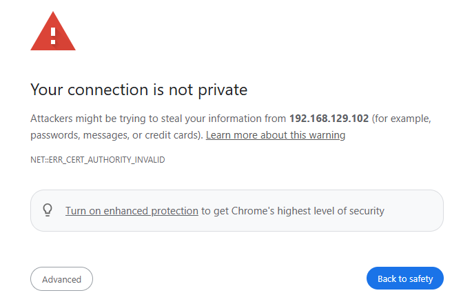
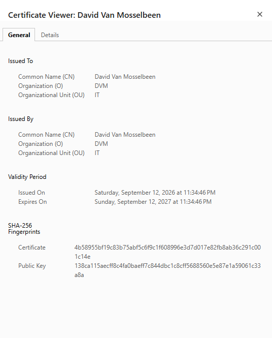

# Apache2

## Table of Contents

- [Introduction](#introduction)
- [Installing and configuring Apache2](#installing-and-configuring-apache2)
- [Configuring Apache](#configuring-apache2)
- [Installing and configuring PHP](#installing-and-configuring-php)
  - [Enabling userdir](#enabling-userdir) 
- [Enable https](#enable-https)
  - [Create custom ssl certificates](#create-custom-ssl-certificates)
- [Tools](#tools)
- [TODO](#todo)
- [Resources](#resources)

## Introduction

`Apache` is probably the most used web server. It's rock solid, well documented and has a great user base and support. 

## Installing and configuring Apache2

### Installing Apache2

Installing `apache2`:

    apt-get update
    apt-get install apache2

### Configuring Apache2

By default, the `apache 2 server` is only running on the non encrypted `http` protocol. So we should absolutely enable `https`.

## Installing and configuring PHP

We need to install the `mod-php` for apache 2.

    apt-get install php libapache2-mod-php

Test if `PHP` is working, for this we will create the file `/var/www/html/phpinfo.php` with the following content:

````commandline
<?php phpinfo(); ?>
````

Point your browser to,<http://localhost/phpinfo.php> and it should give you a bunch of `PHP` related information.

### Enabling userdir

Enabling `userdir` will allow all users to have their own website in `~/public_html`:

````editorconfig
a2enmod userdir
````

By default, `PHP` is not enabled for `userdir`. If you want to allow `userdir` to allow using `PHP`, change the following:

````commandline
nano /etc/apache2/mods-enabled/php7.3.conf
````

*Note that the `PHP` version will be probably different.*

From this:

````editorconfig
# Running PHP scripts in user directories is disabled by default
#
# To re-enable PHP in user directories comment the following lines
# (from <IfModule ...> to </IfModule>.) Do NOT set it to On as it
# prevents .htaccess files from disabling it.
<IfModule mod_userdir.c>
    <Directory /home/*/public_html>
        php_admin_flag engine Off
    </Directory>
</IfModule>
````

To this:

````editorconfig
# Running PHP scripts in user directories is disabled by default
#
# To re-enable PHP in user directories comment the following lines
# (from <IfModule ...> to </IfModule>.) Do NOT set it to On as it
# prevents .htaccess files from disabling it.
#<IfModule mod_userdir.c>
#    <Directory /home/*/public_html>
#        php_admin_flag engine Off
#    </Directory>
#</IfModule>
````

Restart the `apache2` server:    
    
    systemctl restart apache2

**NOTE: This still now work. I have created the directory `~/public_html/` and created a basic `index.html` file but no success. I keep getting the error `403: Forbidden`. I have tried just to turn on the `php_admin_flag engine On` but no success either. No idea what's happening. I have the same issues on a plain `Raspberry Debian` and `Ubuntu` version.**

## Enable https

The `https` is not enabled by default for `apache2`. This is mainly due because if you do not pay for a certification, you will get a warning that the site can not be trusted. There are dedicated companies who manage the `SSL` certificates.

*When you navigate to your website via HTTPS, you’ll be warned that it’s not a trusted certificate. That’s okay. We know this since we signed it ourselves! Just proceed and you will see your actual website. This will not happen if you use a paid SSL certificate or an SSL certificate provided by Letsencrypt.*

Start by reading the documentation:

````commandline
zless /usr/share/doc/apache2/README.Debian.gz
````

We need to check if the `ssl-cert` package has been installed, normally it is, if not, install it:

````commandline
dpkg -l ssl-cert
````

Enable `ssl` site:

````commandline
a2ensite default-ssl
````

Enable the module `ssl`:

````commandline
a2enmod ssl
````

Reload apache configuration file:

````commandline
systemctl reload apache2
````

If you now got to your website, in this example <https://192.168.129.100/> you will see that `https` is working but that you receive a warning.



We need to press the `Advanced` button, then `Proceed to 192.168.129.100 (unsafe)` to continue.

See also: `/etc/apache2/sites-available/default-ssl.conf`

### Create custom ssl certificates

This is only useful if you want to have your information in the certificate. Creating your own certificate will not make in sort that the warning issue will be gone.

Let's create a certificate that will be valid for 10 years.

````commandline
openssl req -x509 -nodes -days 3650 -newkey rsa:2048 -keyout /etc/ssl/private/raspberrypi-server-4gb.home.key -out /etc/ssl/certs/raspberrypi-server-4gb.home.crt
````

We then get a bunch of questions that we need to reply too. Actually it's not mandatory to fill in anything, but then there's no point of creating a custom certificate.

````commandline
You are about to be asked to enter information that will be incorporated                                                   │If you are running Apache in a vserver environment, the start script may not
into your certificate request.                                                                                             │be allowed to set the maximum number of open files. You should adjust
What you are about to enter is what is called a Distinguished Name or a DN.                                                │APACHE_ULIMIT_MAX_FILES in /etc/apache2/envvars to your setup. You can
There are quite a few fields but you can leave some blank                                                                  │disable changing the limits by setting APACHE_ULIMIT_MAX_FILES=true .
For some fields there will be a default value,                                                                             │
If you enter '.', the field will be left blank.                                                                            │
-----                                                                                                                      │For Developers
Country Name (2 letter code) [AU]:BE                                                                                       │==============
State or Province Name (full name) [Some-State]:Belgium                                                                    │
Locality Name (eg, city) []:Ukkel                                                                                          │The Apache 2 web server package provides several helpers to assist
Organization Name (eg, company) [Internet Widgits Pty Ltd]:DVM                                                             │packagers to interact with the web server for both, build and installation
Organizational Unit Name (eg, section) []:IT                                                                               │time. Please refer to the PACKAGING file in the apache2 package for
Common Name (e.g. server FQDN or YOUR name) []:David Van Mosselbeen                                                        │detailed information.
Email Address []:david.van.mosselbeen@gmail.com
````

Now we need to edit the ssl configuration file to point to our custom ssl file:

````commandline
nano /etc/apache2/sites-available/default-ssl.conf
````

And there we should modify the path to our own newly created `public` and `private` key.

````editorconfig
SSLCertificateFile      /etc/ssl/certs/raspberrypi-server-4gb.home.crt
SSLCertificateKeyFile   /etc/ssl/private/raspberrypi-server-4gb.home.key
````

We should check that the configuration files of `Apache 2` is okay. And if we get `Syntax OK` then it's okay.

````commandline
apache2ctl -t
````

Restart the apache 2 server:

````commandline
systemctl restart apache2
````

And like said, we still get the non trust warning. If we check the certification details, we clearly see it's been using the custom certification we created. 



## Tools

| Application | Description |
|---|-------------------------------------------------------------------------------------------------------------------------------------------------------------------------------------------------------------------------------------------|
| apachetop | Realtime Apache monitoring tool |
| awffull | web server log analysis program forked from `Webalizer`. It adds a number of new features and improvements, such as extended frontpage history, resizable graphs, and a few more pie charts. See the dedicated [awffull](awffull.md) page. |
| awstats | powerful and featureful web server log analyzer. See the dedicated [awstats](awstats.md) page. |
| webalizer | web server log analysis program. (probably the oldes program, take a look to awffull or awstats. |

## TODO 

 - [ ] Get `userdir` working, which is not the case yet with the information listed here.
 - [X] Configure to make use of `https`.

## Resources

- <https://www.raspberrypi.com/documentation/computers/remote-access.html#set-up-an-apache-web-server>
- <https://askubuntu.com/questions/24829/how-do-i-turn-on-ssl-for-test-server>
- <https://www.rosehosting.com/blog/how-to-enable-https-protocol-with-apache-2-on-ubuntu-20-04/?srsltid=AfmBOopEKmSpX1N0JBP-XZLadaUJ4nkkvGUhR6xy4lvqP7FxsOFGV8pN>
