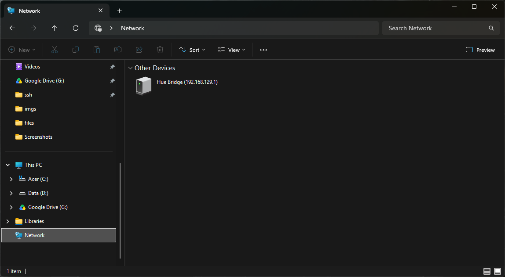
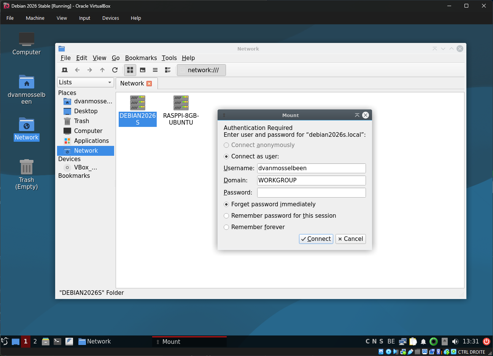
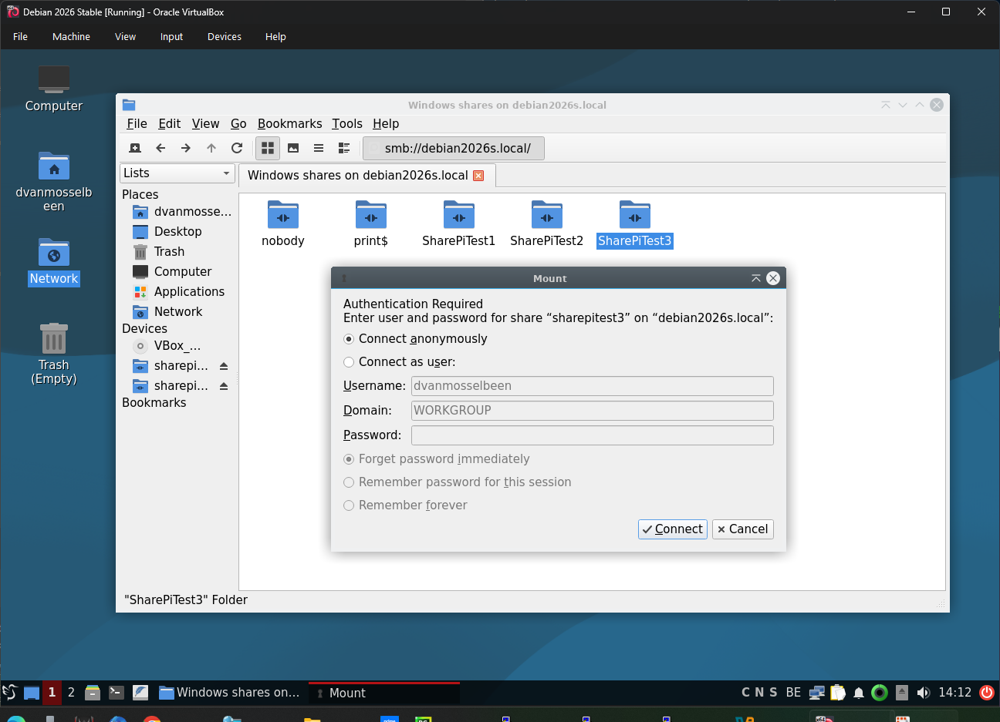
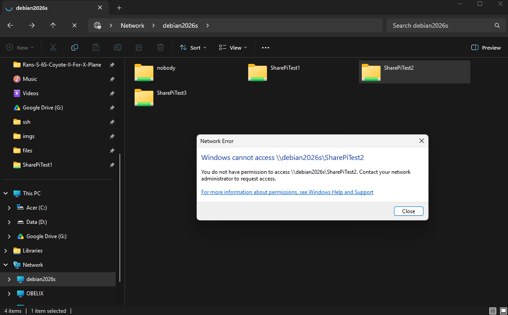

# Samba

## Table of Contents

- [Introduction](#introduction)
- [Installation](#installation)
- [Configuration](#configuration)
  - [Creating the shared folders](#creating-the-shared-folderse)
  - [Creating the shares](#creating-the-shares)
  - [Create the samba users](#create-the-samba-users)
- [Other things](#other-things)
- [Resources](#resources)

## Introduction

`Samba` is software which allows us to share data with `Microsoft Windows` computers but also with `GNU / Linux` and `Mac OS`. This document tries to guide step by step how to set up share with the `samba` server.

This setup has been tested on: `Debian 13 codename Trixie`, `Debian Trixie for Raspberry Pi`, `Ubuntu for Raspberry Pi` around september 2026.

## Installation

First update the system:

````commandline
sudo apt-get update
sudo apt-get upgrade
````

Finally, install the samba package:

````commandline
sudo apt-get install samba
````

We should now already be able to see this computer on the network. But of course with no share.

On `Microsoft Windows`, you can access that computer on: `\\<IP>`. With the `Windows File Manager` you need to specify the exact path because we can not browse there. It looks like it is not available:



*Note, on some Microsoft Windows Systems we can not even yet access the share, on other systems yes. I do not know why.*

On `GNU / Linux` it will be: `smb://<IP>`. Or on a `Debian GNU / Linux version 13 (codename Trixie)` with default desktop environment, we can see the shared `Samba` server with the default file manager. (The file manager is `PCManFM-Qt Version: 2.1.0`). However, when we try to enter our `Samba` test server called `Debian2016S`, the file manager ask us to indentify us.



## Configuration

We will show some basic test configuration so that you can get the grasp on it. We will try to show some different user cases.

### Creating the shared folders

We will now create our test shares. In this example we will create 3 different shares:

- `SharePiTest1`: Readable by everyone.
- `SharePiTest2`: Readable and writeable by everyone
- `SharePiTest3`: Readable and writeable depending on user rights and after identify ourselves.

First, create the directory that will hold the main shared data. In this directory we will create other directories which will hold our shared data:

````commandline
sudo mkdir /media/data
````

If we check the file permission, everyone can read and execute, but not everyone can write:

````commandline
sudo ls -lah /media/
total 16K
drwxr-xr-x  4 root root 4.0K Sep 17 13:51 .
drwxr-xr-x 19 root root 4.0K Aug 27 18:01 ..
lrwxrwxrwx  1 root root    6 Aug 27 17:50 cdrom -> cdrom0
drwxr-xr-x  2 root root 4.0K Aug 27 17:50 cdrom0
drwxr-xr-x  2 root root 4.0K Sep 17 13:51 data

````

Give all permissions to the folder:

````commandline
sudo chmod 775 /media/data
````

Whe verify now the user rights:

````commandline
sudo ls -lah /media/
total 16K
drwxr-xr-x  4 root root 4.0K Sep 17 13:51 .
drwxr-xr-x 19 root root 4.0K Aug 27 18:01 ..
lrwxrwxrwx  1 root root    6 Aug 27 17:50 cdrom -> cdrom0
drwxr-xr-x  2 root root 4.0K Aug 27 17:50 cdrom0
drwxrwxr-x  2 root root 4.0K Sep 17 13:51 data
````

*Note that we created previous directory with `root` user, so we can not write there.*

````commandline
chown <Main_User_Account> /media/data/
chgrp <Main_User_Account> /media/data/
````

It is now looking like this:

````commandline
sudo ls -lah /media/
total 16K
drwxr-xr-x  4 root           root           4.0K Sep 17 13:51 .
drwxr-xr-x 19 root           root           4.0K Aug 27 18:01 ..
lrwxrwxrwx  1 root           root              6 Aug 27 17:50 cdrom -> cdrom0
drwxr-xr-x  2 root           root           4.0K Aug 27 17:50 cdrom0
drwxrwxr-x  4 dvanmosselbeen dvanmosselbeen 4.0K Sep 17 13:56 data
````

Creating our different subdirectories for our shares:

````commandline
sudo mkdir /media/data/test1
sudo mkdir /media/data/test2
sudo mkdir /media/data/test3
````

*Yes, I avoided using a fancy trick to make the 3 directories in 1 go.*

The structure should look like this now:

````commandline
sudo ls -lah /media/data/
total 20K
drwxrwxrwx 5 dvanmosselbeen dvanmosselbeen 4.0K Sep 17 13:57 .
drwxr-xr-x 4 root           root           4.0K Sep 17 13:51 ..
drwxr-xr-x 2 root           root           4.0K Sep 17 13:55 test1
drwxr-xr-x 2 root           root           4.0K Sep 17 13:55 test2
drwxr-xr-x 2 root           root           4.0K Sep 17 13:57 test3
````

Adjusting the user rights to our shared directories:

````commandline
sudo chmod 770 /media/data/test1
sudo chmod 775 /media/data/test2
sudo chmod 777 /media/data/test3
````

*Note that the `test2` directory has other permissions. But on the final result they will all 3 have different permissions.*

The structure should look like this now:

````commandline
sudo ls -lah /media/data/
total 20K
drwxrwxrwx 5 dvanmosselbeen dvanmosselbeen 4.0K Sep 17 13:57 .
drwxr-xr-x 4 root           root           4.0K Sep 17 13:51 ..
drwxrwxrwx 2 root           root           4.0K Sep 17 13:55 test1
drwxrwx--- 2 root           root           4.0K Sep 17 13:55 test2
drwxrwxrwx 2 root           root           4.0K Sep 17 13:57 test3
````

We create now 3 test files in our 3 different shares:

````commandline
sudo echo "Hello World" >> /media/data/test1/my_test.txt
sudo echo "Hello World" >> /media/data/test2/my_test.txt
sudo echo "Hello World" >> /media/data/test3/my_test.txt
````

It is looking like this now:

````commandline
sudo ls -lah /media/data/test*
/media/data/test1:
total 12K
drwxrwxrwx 2 root           root           4.0K Sep 17 14:02 .
drwxrwxrwx 5 dvanmosselbeen dvanmosselbeen 4.0K Sep 17 13:57 ..
-rw-r--r-- 1 root           root             12 Sep 17 14:02 my_test.txt

/media/data/test2:
total 12K
drwxrwx--- 2 root           root           4.0K Sep 17 14:03 .
drwxrwxrwx 5 dvanmosselbeen dvanmosselbeen 4.0K Sep 17 13:57 ..
-rw-r--r-- 1 root           root             12 Sep 17 14:03 my_test.txt

/media/data/test3:
total 12K
drwxrwxrwx 2 root           root           4.0K Sep 17 14:03 .
drwxrwxrwx 5 dvanmosselbeen dvanmosselbeen 4.0K Sep 17 13:57 ..
-rw-r--r-- 1 root           root             12 Sep 17 14:03 my_test.txt
````

We are now ready to create our share configuration in the `samba` configuration.

### Creating the shares

Edit the `/etc/samba/smb.conf` configuration file. And on the end of the file add the following:

````editorconfig
###########################################################
### My Samba Shares                                     ###
###########################################################

[SharePiTest1]
comment = RaspberryPi Test 1 Share
public = yes
writeable = yes
browsable = yes
path = /media/data/test1
create mask = 0777
directory mask = 0777

[SharePiTest2]
comment = RaspberryPi Test 2 Share
public = yes
writeable = yes
browsable = yes
path = /media/data/test2
create mask = 0777
directory mask = 0777

[SharePiTest3]
comment = RaspberryPi Test 3 Share
public = no
writeable = yes
browsable = yes
path = /media/data/test3
create mask = 0770
directory mask = 0770
````

Restart the `samba` server:

````commandline
sudo systemctl restart smbd
````

On a `GNU / Linux Debian` system, I can now access the samba server. I can enter the `SharePiTest1`, read the existing file but not modify it. I can create new files there. When I try to enter the `SharePiTest2` directory, I get access denied. And when I tried to access `SharePiTest3` I get a Login window.



On Microsoft Window I can also enter the shares `SharePiTest1`. Read the existing file, but not modify it. I can create new files. But when I tried to enter `SharePiTest2` or `SharePiTest3` I get a network error with the message. `You do not have permission to access...`.




**So we clearly see that the `samba` server reacts differently depending on the operating system. This can be confusing.**

As I modified the content of our test files and created new test files from the `GNU / Linux` and `Microsoft Windows` computers, and we can see that the ownership of the files changed. 

````commandline
sudo ls -lah /media/data/test*
/media/data/test1:
total 12K
drwxrwxrwx 2 root           root           4.0K Sep 18 02:04  .
drwxrwxrwx 5 dvanmosselbeen dvanmosselbeen 4.0K Sep 18 01:35  ..
-rw-r--r-- 1 root           root             12 Sep 18 01:37  my_test.txt
-rwxrw-rw- 1 nobody         nogroup           0 Sep 18 01:46 'New file'
-rwxrw-rw- 1 nobody         nogroup           0 Sep 18 02:04 'New Text Document.txt'

/media/data/test2:
total 12K
drwxrwx--- 2 root           root           4.0K Sep 18 01:37 .
drwxrwxrwx 5 dvanmosselbeen dvanmosselbeen 4.0K Sep 18 01:35 ..
-rw-r--r-- 1 root           root             12 Sep 18 01:37 my_test.txt

/media/data/test3:
total 12K
drwxrwxrwx 2 root           root           4.0K Sep 18 01:37 .
drwxrwxrwx 5 dvanmosselbeen dvanmosselbeen 4.0K Sep 18 01:35 ..
-rw-r--r-- 1 root           root             12 Sep 18 01:37 my_test.txt
````

### Create the samba users

We create the samba users with the command `smbpasswd`. Let's first check what options we have by executing `smbpasswd -h`.

````commandline
smbpasswd -h
When run by root:
    smbpasswd [options] [username]
otherwise:
    smbpasswd [options]

options:
  -L                   local mode (must be first option)
  -h                   print this usage message
  -s                   use stdin for password prompt
  -c smb.conf file     Use the given path to the smb.conf file
  -D LEVEL             debug level
  -r MACHINE           remote machine
  -U USER              remote username (e.g. SAM/user)
extra options when run by root or in local mode:
  -a                   add user
  -d                   disable user
  -e                   enable user
  -i                   interdomain trust account
  -m                   machine trust account
  -n                   set no password
  -W                   use stdin ldap admin password
  -w PASSWORD          ldap admin password
  -x                   delete user
  -R ORDER             name resolve order
````

````commandline
sudo smbpasswd -L -a <USERNAME>
````

It will ask to introduce a new password. **Which is annoying as it does not use the existing password of the `GNU / Linux` machine.**

Restart `samba` again:

````commandline
sudo systemctl restart smbd
````

**By default, on `Raspberry Pi OS Debian Trixie`, it has also created a share on the samba server with the username and with access to the home of that user. Can be handy. On `Raspberry Pi OS Ubuntu` this is not enable by default and we find configuration settings about this in `/etc/samba/smb.conf`.See the section `Share Definitions` and comment it if you don't want to make use of username shared directories.**

## Other things

If you are playing around and testing with this configuration, and if you have tried to uninstall everything and purge the `samba` package. If you have deleted the file `/etc/samba/smb.conf`, you would have to reinstall `samba-common` to restore that configuration file.

If you messed up with the user rights on your shared data directories, you can change the permissions recursively:

````commandline
chmod 700 /media/data -R
````

## Resources

- <https://raspberrytips.com/raspberry-pi-file-server/>
- <https://www.raspberrypi.com/documentation/computers/remote-access.html#samba>
- <https://raspberrytips.com/openmediavault-on-raspberry-pi/>