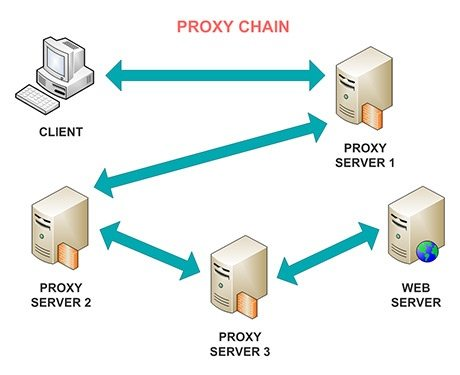

# Tor

A beginner oriented guide on using the Tor network.

Source: <https://tryhackme.com/room/torforbeginners>

## Unit 1 - Tor

Tor is a free and open-source software for enabling anonymous communication. `tor` directs Internet traffic through a free, worldwide, volunteer overlay network consisting of more than seven thousand relays to conceal a user's location and usage from anyone conducting network surveillance or traffic analysis. Using `tor` makes it more difficult to trace Internet activity to the user: this includes "visits to Websites, online posts, instant messages, and other communication forms". `tor`'s intended use is to protect the personal privacy of its users, as well as their freedom and ability to conduct confidential communication by keeping their Internet activities unmonitored.

In penetration testing, there might be a need to conduct a full-fledged black-box test. This is a form of testing in which security professionals have to deal with such things as firewalls and other mechanisms of restriction on the customer’s side. In this case, the `tor` network can be used in order to constantly change IP and DNS addresses and therefore successfully overcome any restrictions.

In this unit, we are going to install the `tor` service and learn basic commands.

- Run `apt-get install tor` to install/update your `tor` packages
- Run `service tor start` to start the `tor` service
- Run `service tor status` to check `tor`'s availability
- Run `service tor stop` to stop the `tor` service

## Unit 2 - Proxychains

**Read me:** <https://github.com/haad/proxychains>

`Proxychains` - a tool that forces any TCP connection made by any given application to follow through proxy like `tor` or any other `SOCKS4`, `SOCKS5` or `HTTP`(S) proxy.

`Proxychains` is widely used by pentesters during the reconnaissance stage (For example with `nmap`).

Let's start with running `apt install proxychains` to install/update `proxychains` tool.

Now it's time to configure proxychains to work properly

Run `nano /etc/proxychains4.conf` to edit the settings. (Note: You can use any text editing tool instead of `nano`)

We can now see, that most of the methods are under comment mark. You can read their description and decide on using one of them in the future. For this lesson let's uncomment `dynamic_chain` and comment others (simply put '`#`' to the left). Additionally, it is useful to uncomment `proxy_dns in order` to prevent DNS leak. Scroll through the document and see whenever you want to add some additional proxies at the bottom of the page (which is not required at this point).

Apply all the settings.

Now let's check our settings.

Start the `tor` service and run `proxychains4 firefox`. Usually, you are required to put '`proxychains`' command before anything in order to force it to transfer data through Tor.

After the firefox has loaded, check if your IP address has changed with any website that provides such information. Also, try running a test on <https://dnsleaktest.com> and see if your DNS address changed too.

NOTE: All other web browser windows should be closed before opening firefox through `proxychains`!

 ## Unit 3 - Tor browser

Tor browser, as seen from its name, is a browser that transfers all its traffic through TOR and by using firefox headers makes all Tor users look the same.

On a daily basis, Tor browser is useful for anyone who wants to keep their internet activities out of the hands of advertisers, ISPs, and web sites. That includes people getting around censorship restrictions in their country, police officers looking to hide their IP address or anyone else who doesn't want their browsing habits linked to them.

Install `tor` browser on your system (It is not necessarily to do this on your Kali Machine).

- [Windows, Mac OS installation](https://www.torproject.org/)
- [Kali Linux guide](https://hackingpress.com/install-tor-on-kali-linux/#Step_1_Create_a_new_user)

Launch the `tor` Browser and set your privacy settings to Level 2 (Safer)

## Resources

- <https://www.youtube.com/watch?v=qsA8zREbt6g>
- <https://spys.one/en/> - Some Free Proxy listing.
