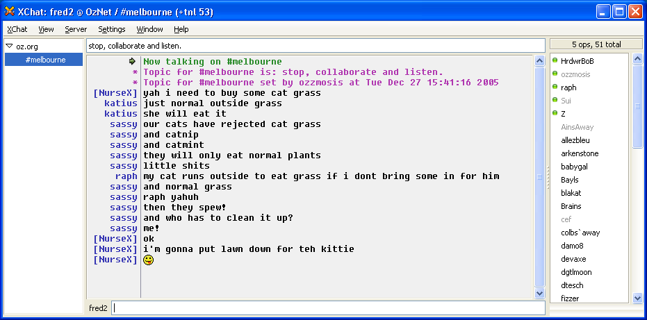

# XChat

## Table of Contents

- [Introduction](#introduction)
- [Tweaks I like](#tweaks-i-like)
  - [See the date & time of the messages](#see-the-date--time-of-the-messages)
- [Resources](#resources) 

## Introduction

**Note, it seems that `XChat` has not been updated since `August 28, 2010`.**

`XChat` is a very easy to use `GUI IRC` client. `IRC` stand for `Internet Relay Chat`. If you don't know what an `IRC` client is, then you probably don't know what an `IRC` network is. Basically it's a system to get in touch with other people so that you can chat together. Another famous `IRC` client is `irssi`, and you can read the dedicated [irssi page](irssi.md) for more information.

An `IRC` server probably has different channels. Each channel has his very specific topic of discussion. Usually this is a tool to get support or to give support. It's very popular in the open source world. For example, if you are using the `Debian GNU / Linux` operating system, you will probably try to search for you this network and channel. So that you can talk with other people about `Debian`. Probably because you have some issue that you want to get fixed.

Here is how XChat looks like:

## Tweaks I like

### See the date & time of the messages

`Interface` > `Text box` > `Time Stamps` - Check the option `Enable time stamps` and adjust the content of the field `Time Stamp format` to

    [%D-%H:%M]
     
## Resources

- <https://xchat.org>