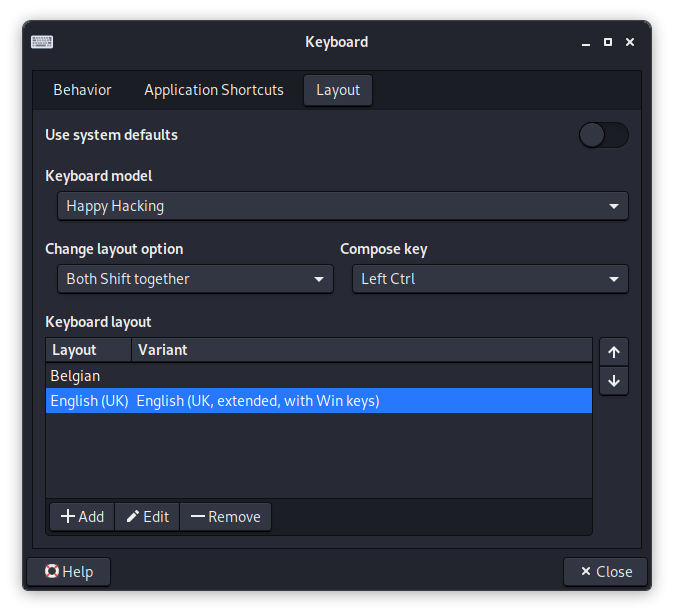

# Kali

## Table of Contents

- [Introduction](#introduction)
- [Interesting tools](#interesting-tools)
- [Updating Kali](#updating-kali)
- [Services](#services)
  - [SSH server](#ssh-server)
- [Special Configuration](#special-configuration)
  - [Proxy Settings](#proxy-settings)
    - [For Burp Suite](#for-burp-suite)
    - [For TOR](#for-tor)
  - [Happy Hacking Keyboard Lite 2](#happy-hacking-keyboard-lite-2)
- [Resources](#resources)

## Introduction

`Kali` is a distribution based on the [GNU/Linux Debian distribution](https://www.debian.org), but made for penetration and security testing.

See also all the documentation related to [Debian GNU/Linux](../Debian/debian.md) as Kali is based on this distribution. Therefore, this document page will only contain specific information regarding `Kali`. 

## Interesting tools

Here's a list of some programs that might be interesting to install on top of the base installation of `Kali`. Note that some apps, like the `sectlists` is very big; around `386MB` to download and whatever once extracted. Some other applications, like `fail2ban`, `htop`, `rlwrap`, `tmux`, `xclip`, `filezilla` etc. are in my opinion a must-have and should be available in a default install.

- `fail2ban` - ban hosts that cause multiple authentication errors
- `beef` - flexible Brainfuck interpreter
- `default-mysql-client` - MySQL database client binaries (metapackage)
- `dsniff` - Various tools to sniff network traffic for cleartext insecurities
- `gobuster` - Directory/file & DNS busting tool written in Go
- `gvim-gtk3` - Vi IMproved - enhanced vi editor - with GTK3 GUI
- `hexedit` - viewer and editor in hexadecimal or ASCII for files or devices
- `htop` - interactive processes viewer
- `remmina` - GTK+ Remote Desktop Client
- `rlwrap` - readline feature command line wrapper
- `seclists` - Collection of multiple types of security lists
- `steghide` - steganography hiding tool - documentation files
- `tmux` - terminal multiplexer
- `xclip` - command line interface to X selections
- `zenmap-kbx` - The Network Mapper Front End
- `filezilla` - Full-featured graphical FTP/FTPS/SFTP client
- `tor` - anonymizing overlay network for TCP
- `monit` - utility for monitoring and managing daemons or similar programs
- `tree` - displays an indented directory tree, in color

_It could be interesting to create a `.deb` (meta-)package which will force the installation of these above packages_

## Updating Kali

After a fresh installation:

```commandline
apt-get update
apt full-upgrade -y
```

Later on:

```commandline
apt-get update
apt-get upgrade
```

Do not forget to time by time:

```commandline
sudo apt autoremove
sudo apg-get clean
```

## Services

### SSH server

Eventually start with reconfigure the server:

```commandline
dpkg-reconfirgure openssh-server
```    

By default, the `openssh-server` is installed but is not launched automatically at boot time. This has it is reason as this is about a penetration machine, and running services at boot time, means more open ports on the machine. So it is maybe wise to not let start the SSH Server at boot time.

```commandline
# Start the server
systemctl start ssh.socket
    
# Stop the server
systemctl stop ssh.socket
```

To permanently enable the SSH service to start whenever the system is booted use:

    systemctl enable ssh.socket

To disable it again

    systemctl disable ssh.socket

## Special Configuration

### Proxy Settings

In `Firefox` I firstly install the [FoxyProxy](https://addons.mozilla.org/en-US/firefox/addon/foxyproxy-standard/?utm_source=addons.mozilla.org&utm_medium=referral&utm_content=search) plugin. This is required to work with `Burp Suite` anyway. In `FireFox`, go to the settings and then in the Add-ons menu. Or use the shortcut key `CTRL + SHIFT + A`. And do a search query for [FoxyProxy](https://addons.mozilla.org/en-US/firefox/addon/foxyproxy-standard/?utm_source=addons.mozilla.org&utm_medium=referral&utm_content=search). Install that plugin.

Once the plugin installed, we need to configure it.

#### For Burp Suite

- Title or Description: `Burp`
- Proxy Type: `HTTP`
- Proxy IP: `127.0.0.1`
- Port: `8080`

#### For TOR

`tor` is not installed by default in `Kali`. To make use of `tor` for anonymous surfing, first install it with `apt-get install tor`. Then launch the service with `systemctl start tor`.

- Title or Description: `TOR`
- Proxy Type: `SOCKS4`
- Proxy IP: `127.0.0.1`
- Port: `9050`

### Happy Hacking Keyboard Lite 2

In the start `menu > Settings > Keyboard`. In that new window set the settings as following: 



As indicated too, switching / cycling between the different keyboard layouts, we can press both shift keys, followed by `CTRL`.

## Resources

- <https://www.kali.org>
- <https://tools.kali.org>
- <https://forums.kali.org>
- <https://www.kali.org/docs/>
- <https://www.kali.org/get-kali/#kali-mobile>
- <https://www.offensive-security.com>
- <https://www.offensive-security.com/metasploit-unleashed/>
- <https://www.exploit-db.com>
- <https://www.exploit-db.com/google-hacking-database>
