# Try Hack Me Writeup - Burp Suite

TryHackMe Burp Suite Room is here: <https://tryhackme.com/room/rpburpsuite>

This writeup of the Burp Suite room is fully detailed with screenshots, the questions and answers.

## Task 1 - Intro

Burp Suite, a framework of web application pentesting tools, is widely regarded as the de facto tool to use when performing web app testing. Throughout this room, we'll take a look at the basics of installing and using this tool as well as it's various major components. Reference links to the associated documentation per section have been provided at the bottom of most tasks throughout this room. 

Prior to attempting this room, I highly recommend checking out the '[Web Fundamentals](https://tryhackme.com/room/webfundamentals)' room. If you are familiar with basic web request structure and SQL injection, you're already set!

Enjoy the room! For future rooms and write-ups, follow [@darkstar7471](https://twitter.com/darkstar7471) on Twitter.

## Task 2 - Installation

Before we can dive into the pretty amazing tool that is Burp Suite, we'll first have to install it. Lucky for us, if you're doing this room on Kali Linux you'll already have Burp Suite installed. Since this room is entirely do-able on Windows as well, we'll briefly touch on obtaining Burp Suite (community edition) for any system as it's fairly painless. You can also use deploy your own in-browser machine with BurpSuite already installed!

If you'll be installing Burp (as it's commonly referred to) from scratch, you'll need to first visit this link: https://portswigger.net/burp/communitydownload

We'll use the Burp Suite Community Edition throughout this lab, however, I'll be covering some paid features briefly as well to help you prepare for eventually using the Professional version.

Burp Suite Getting Started Documentation: https://portswigger.net/burp/documentation/desktop/getting-started

If you'll be installing Burp (as it's commonly referred to) from scratch, you'll need to first visit this link: https://portswigger.net/burp/communitydownload

Once you've reached the Port Swigger downloads page, go ahead and download the appropriate version for your operating system

Burp Suite requires Java JRE in order to run. Download and install Java here: https://www.java.com/en/download/

Once you've got everything setup move onto our next task, `Gettin' [CA] Certified`!

## Task 3 - Getting' [CA] certified

Before we can start using our new installation (or preinstalled) Burp Suite, we'll have to fix a certificate warning. We need to install a CA certificate as BurpSuite acts as a proxy between your browser and sending it through the internet - It allows the BurpSuite Application to read and send on HTTPS data. 

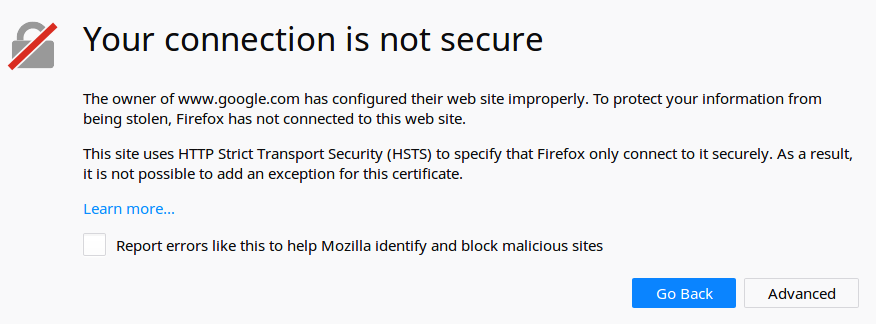

A certificate warning that will appear unless we install Burp's CA Certificate.

**One quick note, in this lab I'll be using Firefox and Foxy Proxy** ([which you can find here](https://addons.mozilla.org/en-US/firefox/addon/foxyproxy-standard/)). I use Firefox in this instance as it's a little bit easier to work with when using Burp Suite. 

First, let's go ahead and launch Burp. We can do this on Kali via the icon on the left side. In the image below it's the seventh icon from the top on the left-hand side. **If your Kali desktop doesn't look like the screenshot below, click on 'Applications' and type in Burp Suite. Click on the Burp Suite icon that appears.**

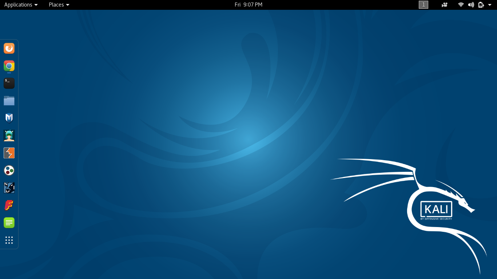

Launch Burp!

Once you've launched Burp, you'll be greeted with the following screen:

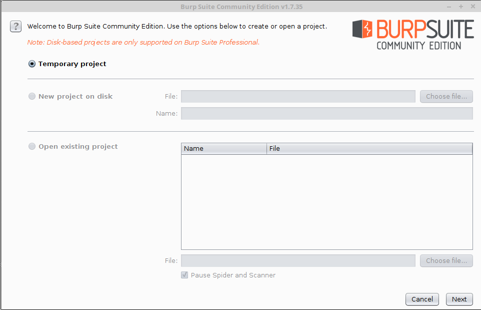

Once this pops-up, click 'Temporary project' and then 'Next'.

**Now as you likely noticed both 'New project on disk' and 'Open existing project' are both grayed out. As annotated at the top of this window saving projects is a feature associated with Burp Suite Professional as it's pretty common to save and come back to a multi-day web application test.**

Next, we'll be prompted to ask for what configuration we'd like to use. For now, select '`Use Burp defaults`'.

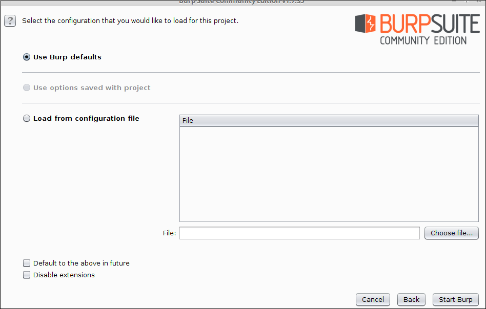

This option is included as it can be incredibly useful to create a custom configuration file for your proxy or other settings, especially depending on how your network configuration and/or if Burp Suite is being launched remotely such as via [x11 forwarding](https://www.youtube.com/watch?v=auePeI8vZA8).

Finally, let's go ahead and Start Burp! Click '`Start Burp`' now!

You'll now see a screen that looks similar to this:

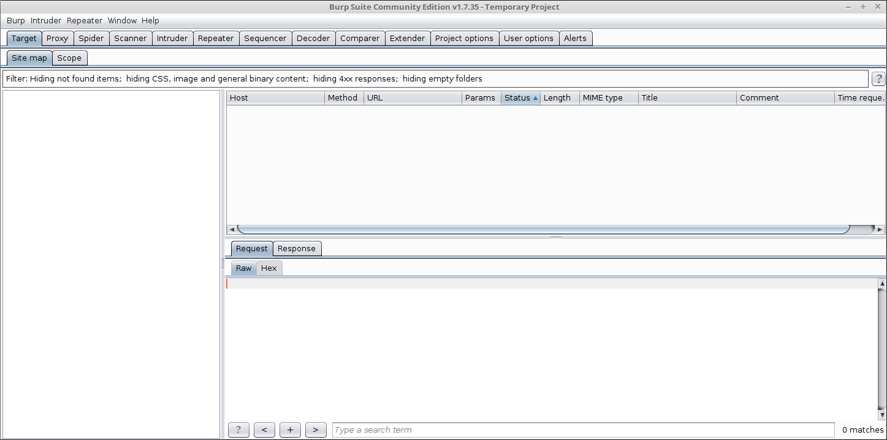

Since we now have Burp Suite running, the proxy service will have started by default with it. In order to fully leverage this proxy, we'll have to install the CA certificate included with Burp Suite (otherwise we won't be able to load anything with SSL). To do this, let's launch Firefox now!

*You can do this part with your browser of choice, however, I'll be using Firefox for this room.

Now that we've started Burp, let's add an extension to our web browser to allow up to easily route or traffic through it! For this room, we'll be using 'FoxyProxy Standard' on Firefox.

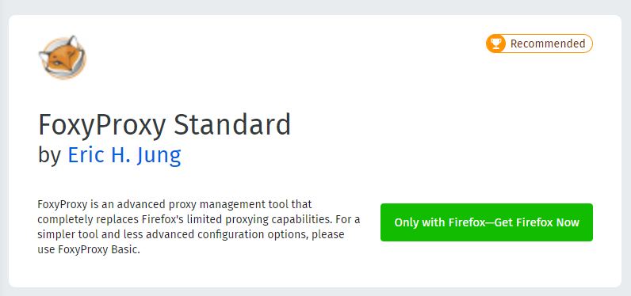

Navigate to the following link to install FoxyProxy Standard: [Link](https://addons.mozilla.org/en-US/firefox/addon/foxyproxy-standard/)

Go ahead and install this now!

Next, click on FoxyProxy among your extensions.

After that, click on 'Options'.

After that, click 'Add' in the top left. 

Enter in the following settings and then click 'Save'

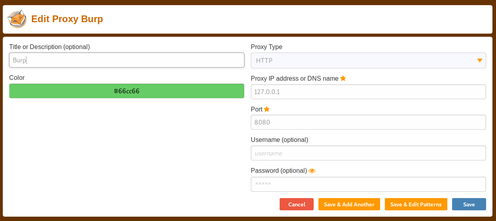

Finally, click on the FoxyProxy extension icon again and select 'Burp'.

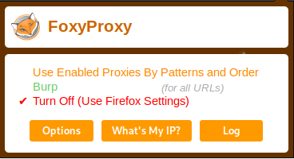

In the image above Burp isn't selected. Make sure it is in yours!

Next, we'll move onto adding the certificate for Burp!

With Firefox, navigate to the following address: http://localhost:8080

You'll be greeted with the following website:

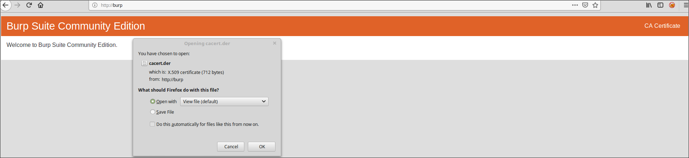

Click on 'CA Certificate' in the top right to download and save the CA Certificate.

Now that we've downloaded the CA Certificate, move over to the settings menu in Firefox. Search for 'Certificates' in the search bar.

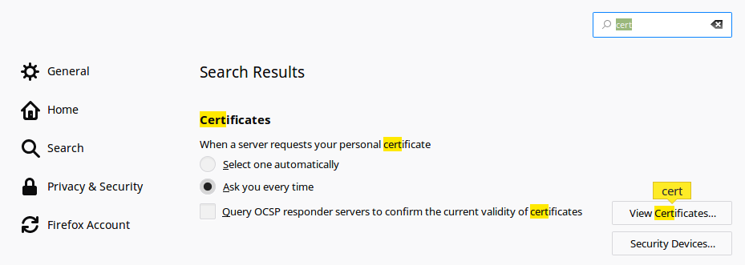

Click on 'View Certificates'

Next, in the Authorities tab click on 'Import'

Navigate to where you saved the CA Certificate we downloaded previously. Click 'OK' once you've selected this certificate.

Finally, select the following two options seen in this photo:

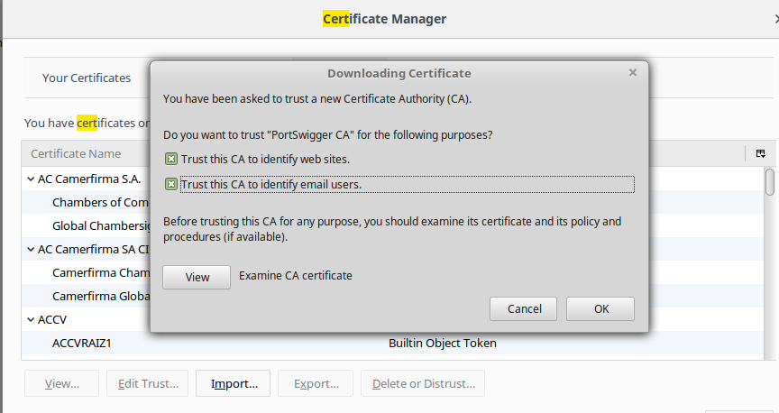

Select 'OK' once you've done this. Congrats, we've now installed the Burp Suite CA Certificate!

## Task 4 - Overview of Features

Now that we've set up Burp, let's take a look at everything it has to offer. Web application pentesting can be a messy affair but Burp has something for every step of the way. 

Throughout this room, we'll be taking a look at these components of Burp Suite. Here's a quick overview of each section covered:

* **Proxy** - What allows us to funnel traffic through Burp Suite for further analysis
* **Target** - How we set the scope of our project. We can also use this to effectively create a site map of the application we are testing.
* **Intruder** - Incredibly powerful tool for everything from field fuzzing to credential stuffing and more
* **Repeater** - Allows us to 'repeat' requests that have previously been made with or without modification. Often used in a precursor step to fuzzing with the aforementioned Intruder
* **Sequencer** - Analyzes the 'randomness' present in parts of the web app which are intended to be unpredictable. This is commonly used for testing session cookies
* **Decoder** - As the name suggests, Decoder is a tool that allows us to perform various transforms on pieces of data. These transforms vary from decoding/encoding to various bases or URL encoding.
* **Comparer** - Comparer as you might have guessed is a tool we can use to compare different responses or other pieces of data such as site maps or proxy histories (awesome for access control issue testing). This is very similar to the Linux tool diff.
* **Extender** - Similar to adding mods to a game like Minecraft, Extender allows us to add components such as tool integrations, additional scan definitions, and more!
* **Scanner** - Automated web vulnerability scanner that can highlight areas of the application for further manual investigation or possible exploitation with another section of Burp. This feature, while not in the community edition of Burp Suite, is still a key facet of performing a web application test.

### Answer the questions bellow

Which tool in Burp Suite can we use to perform a 'diff' on responses and other pieces of data?

    Comparer

What tool could we use to analyze randomness in different pieces of data such as password reset tokens?

    Sequencer

Which tool can we use to set the scope of our project?

    Target

While only available in the premium versions of Burp Suite, which tool can we use to automatically identify different vulnerabilities in the application we are examining?

    Scanner

Encoding or decoding data can be particularly useful when examining URL parameters or protections on a form, which tool allows us to do just that?

    Decoder

Which tool allows us to redirect our web traffic into Burp for further examination?

    Proxy

Simple in concept but powerful in execution, which tool allows us to reissue requests?

    Repeater

With four modes, which tool in Burp can we use for a variety of purposes such as field fuzzing?

    Intruder

Last but certainly not least, which tool allows us to modify Burp Suite via the addition of extensions?

    Extender

## Task 5 - Engage Dark Mode

Working on a project late at night? Fear no more! In this task we'll cover how to enable dark mode in Burp Suite!

This task is optional! You can simply click 'Complete' on all of the questions if you'd like to skip it. This section is purely for 'quality of life' improvements while using Burp Suite throughout this room. You can see what dark mode looks like in question three of task eight.

With Burp Suite launched, let's first navigate to the 'User options' tab. 

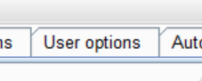

Next, click on the 'Display' sub-tab. 

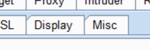

Now, click on the 'Look and feel' drop-down menu. Select 'Darcula'.

**Note that with newer versions you have only the option `Light` or `Dark`**

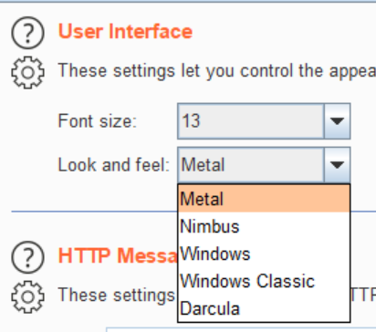

Finally, close and relaunch Burp Suite to have dark theme (or whichever theme you picked) take effect.

## Task 6 - Proxy

Generally speaking, proxy servers by definition allow us to relay our traffic through an alternative route to the internet. This can be done for a variety of reasons ranging from educational filtering (common in schools where restricted content must be blocked) to accessing content that may be otherwise unavailable due to region locking or a ban. Using a proxy, however, for web application testing allows us to view and modify traffic inline at a granular level. Throughout this task, we'll explore the major components of the Burp proxy including interception, request history, and the various configuration options we have access to.

Basic diagram of how communications are relayed through a proxy - [Wikipedia - Proxy Servers](https://en.wikipedia.org/wiki/Proxy_server)

In task three, `Gettin' [CA] Certified`, we configured our web traffic to route through our instance of Burp Suite. By default, Burp will be set to 'intercept' our traffic. This means a few things:

1. Requests will by default require our authorization to be sent.
2. We can modify our requests in-line similar to what you might see in a man-in-the-middle attack and then send them on.
3. We can also drop requests we don't want to be sent. This can be useful to see the request attempt after clicking a button or performing another action on the website.
4. And last but not least, we can send these requests to other tools such as Repeater and Intruder for modification and manipulation to induce vulnerabilities. 

Burp Suite reference documentation for Proxy: [Link](https://portswigger.net/burp/documentation/desktop/tools/proxy)

### Answer the questions below

Deploy the VM attached to this task!

To complete this task you need to connect to the TryHackMe network through [OpenVPN](https://tryhackme.com/connect). If you're using the [in-browser](https://tryhackme.com/my-machine) machine this isn't needed (but make sure you're accessing the machine and using Burp inside the in-browser machine).

By default, the Burp Suite proxy listens on only one interface. What is it? Use the format of IP:PORT

    127.0.0.1:8080

In Burp Suite, navigate to the Intercept sub-tab of the Proxy section. Enable Intercept

Return to your web browser and navigate to the web application hosted on the VM we deployed just a bit ago. Note that the page appears to be continuously loading. Change back to Burp Suite, we now have a request that's waiting in our intercept tab. Take a look at the actions, which shortcut allows us to forward the request to Repeater?

    CTRL-R

How about if we wanted to forward our request to Intruder?

    CTRL-I

Burp Suite saves the history of requests sent through the proxy along with their varying details. This can be especially useful when we need to have proof of our actions throughout a penetration test or we want to modify and resend a request we sent a while back. What is the name of the first section wherein general web requests (GET/POST) are saved?

    HTTP History

Defined in RFC 6455 as a low-latency communication protocol that doesn't require HTTP encapsulation, what is the name of the second section of our saved history in Burp Suite? These are commonly used in collaborate application which require real-time updates (Google Docs is an excellent example here).

    WebSocket History

Before we move onto exploring our target definition, let's take a look at some of the advanced customization we can utilize in the Burp proxy. Move over to the Options section of the Proxy tab and scroll down to Intercept Client Requests. Here we can apply further fine-grained rules to define which requests we would like to intercept. Perhaps the most useful out of the default rules is our only AND rule. What is it's match type?

    URL

How about it's 'Relationship'? In this situation, enabling this match rule can be incredibly useful following target definition as we can effectively leave intercept on permanently (unless we need to navigate without intercept) as it won't disturb sites which are outside of our scope - something which is particularly nice if we need to Google something in the same browser.

    is in target scope

## Task 7 - Target Definition

Perhaps the most important feature in Burp Suite, we'll now be turning our focus to the Target tab!

The Target tab in Burp allows us to perform arguably some of the most important parts of a web application penetration test: defining our scope, viewing a site map, and specifying our issue definitions (although this is more useful within report generation and scanning). 

When starting a web application test you'll very likely be provided a few things:

- The application URL (hopefully for dev/test and not prod)
- A list of the different user roles within the application
- Various test accounts and associated credentials for those accounts
- A list of pieces/forms in the application which are out-of-scope for testing and should be avoided

From this information, we can now start to build our scope within Burp, something which is incredibly important in the case we are planning on performing any automated testing. Typically this is done in a tiered approach wherein we work our way up from the lowest privileged account (this includes unauthenticated access), browsing the site as a normal user would. Browsing like this to discover the full extent of the site is commonly referenced as the 'happy path'. Following the creation of a site map via browsing the happy path, we can go through and start removing various items from the scope. These items typically fit one of these criteria:

- The item (page, form, etc) has been designated as out of scope in the provided documentation from the client
- Automated exploitation of the item (especially in a credentialed manner) would cause a huge mess (like sending hundreds of password reset emails - If you've done a web app professionally you've probably done this at one point)
- Automated exploitation of the item (especially in a credentialed manner) would lead to damaging and potentially crashing the web app

Once we've removed any restricted or otherwise potentially dangerous items from our scop

### Answer the question below

Before leaving the Proxy tab, switch Intercept to disabled. We'll still see the pages we navigate to in our history and the target tab, just having Intercept constantly stopping our requests for this next bit will get old fast.

Navigate to the Target tab in Burp. In our last task, Proxy, we browsed to the website on our target machine (in this case OWASP Juice Shop). Find our target site in this list and right-click on it. Select 'Add to scope'.

Clicking 'Add to scope' will trigger a pop-up. This will stop Burp from sending out-of-scope items to our site map.

Select 'Yes' to close the popup.

Browse around the rest of the application to build out our page structure in the target tab. Once you've visited most of the pages of the site return to Burp Suite and expand the various levels of the application directory. What do we call this representation of the collective web application?

    Site Map

What is the term for browsing the application as a normal user prior to examining it further?

    happy path

One last thing before moving on. Within the target tab, you may have noticed a sub-tab for issue definitions. Click into that now.

The issue definitions found here are how Burp Suite defines issues within reporting. While getting started, these issue definitions can be particularly helpful for understanding and categorizing various findings we might have. Which poisoning issue arises when an application behind a cache process input that is not included in the cache key?

    Web cache poisoning

## Task 8 - Puttin' it on Repeat[er]

As the name suggests, Repeater allows us to repeat requests we've already made. These requests can either be reissued as-is or with modifications. In contrast to Intruder, Repeater is typically used for the purposes of experimentation or more fine-tuned exploitation wherein automation may not be desired. We'll be checking out Repeater with the goal of finding a proof of concept demonstrating that Juice Shop is vulnerable to SQL injection.

Burp Suite reference documentation for Repeater: [Link](https://portswigger.net/burp/documentation/desktop/tools/repeater)

### Answer the questions below

To start, click 'Account' (this might be 'Login' depending on the version of Juice Shop) in the top right corner of Juice Shop in order to navigate to the login page.

Try logging in with invalid credentials. What error is generated when login fails?

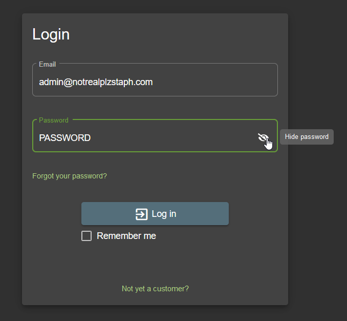

    Invalid email or password

But wait, didn't we want to send that request to Repeater? Even though we didn't send it to Repeater initially via intercept, we can still find the request in our history. Switch over to the HTTP sub-tab of Proxy. Look through these requests until you find our failed login attempt. **Right-click on this request and send it to Repeater and then send it to Intruder, too!**

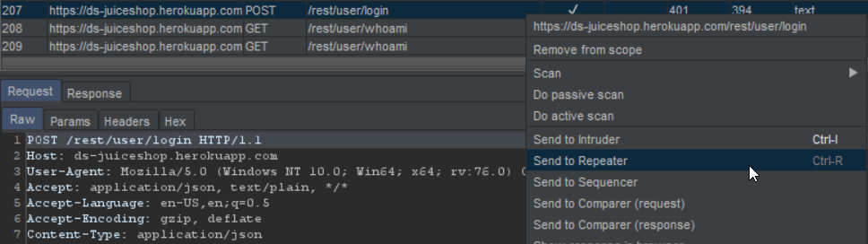

Now that we've sent the request to Repeater, let's try adjusting the request such that we are sending a single quote (') as both the email and password. What error is generated from this request?

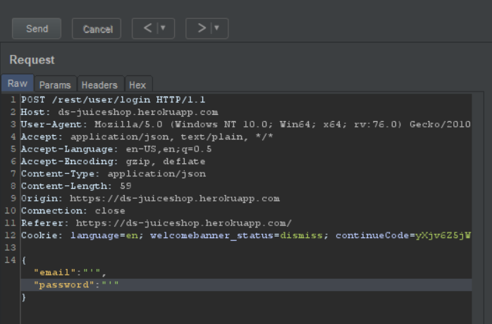

    SQLITE_ERROR

Now that we've leveraged Repeater to gain proof of concept that Juice Shop's login is vulnerable to SQLi, let's try something a little more mischievous and attempt to leave a devastating zero-star review. First, click on the drawer button in the top-left of the application. **If this isn't present for you, just skip to the next question.**

Next, click on 'Customer Feedback' (depending on the version of Juice Shop this also might be along the top of the page next to 'Login' under 'Contact Us')

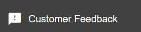

With the Burp proxy on submit feedback. Once this is done, find the POST request in your HTTP History in Burp and send it to Repeater.

What field do we have to modify in order to submit a zero-star review?

    rating

Submit a zero-star review and complete this challenge in Juice Shop!

# Task 9 - Help! There's an Indruder!

Arguably the most powerful tool in Burp Suite, Intruder can be used for many things ranging from fuzzing to brute-forcing. At its core, Intruder serves one purpose: automation. 

While Repeater best handles experimentation or one-off testing, Intruder is meant for repeat testing once a proof of concept has been established. Per the [Burp Suite documentation](https://portswigger.net/burp/documentation/desktop/tools/intruder/using), some common uses are as follows:

- Enumerating identifiers such as usernames, cycling through predictable session/password recovery tokens, and attempting simple password guessing
- Harvesting useful data from user profiles or other pages of interest via grepping our responses
- Fuzzing for vulnerabilities such as SQL injection, cross-site scripting (XSS), and file path traversal

To accomplish these various use cases, [Intruder has four different attack types](https://portswigger.net/burp/documentation/desktop/tools/intruder/positions):

1. `Sniper` - The most popular attack type, this cycles through our selected positions, putting the next available payload (item from our wordlist) in each position in turn. This uses only one set of payloads (one wordlist).

2. `Battering Ram` - Similar to Sniper, Battering Ram uses only one set of payloads. Unlike Sniper, Battering Ram puts every payload into every selected position. Think about how a battering ram makes contact across a large surface with a single surface, hence the name battering ram for this attack type.

3. `Pitchfork` - The Pitchfork attack type allows us to use multiple payload sets (one per position selected) and iterate through both payload sets simultaneously. For example, if we selected two positions (say a username field and a password field), we can provide a username and password payload list. Intruder will then cycle through the combinations of usernames and passwords, resulting in a total number of combinations equalling the smallest payload set provided. 

4. `Cluster Bomb` - The Cluster Bomb attack type allows us to use multiple payload sets (one per position selected) and iterate through all combinations of the payload lists we provide. For example, if we selected two positions (say a username field and a password field), we can provide a username and password payload list. Intruder will then cycle through the combinations of usernames and passwords, resulting in a total number of combinations equalling usernames x passwords. Do note, this can get pretty lengthy if you are using the community edition of Burp.

Intruder Attack Type Selection

For our purposes, we'll be returning to the SQL injection vulnerability we previously discovered through using Repeater. 

For some additional practice on using Intruder, check out the older [Learn Burp Suite room here on TryHackMe](https://tryhackme.com/room/learnburp)

Burp Suite reference documentation for Intruder: [Link](https://portswigger.net/burp/documentation/desktop/tools/intruder)

### Answer the questions below

Which attack type allows us to select multiple payload sets (one per position) and iterate through them simultaneously?

    Pitchfork

How about the attack type which allows us to use one payload set in every single position we've selected simultaneously?

    Battering Ram

Which attack type allows us to select multiple payload sets (one per position) and iterate through all possible combinations?

    Cluster Bomb

Perhaps the most commonly used, which attack type allows us to cycle through our payload set, putting the next available payload in each position in turn?

    Sniper

[Download the wordlist attached to this room](files/xplatform-shortened.txt), this is a shortened version of the [fuzzdb SQLi platform detection list](https://github.com/fuzzdb-project/fuzzdb/blob/master/attack/sql-injection/detect/xplatform.txt). [Or use the copy stored in the repository](files/xplatform.txt).

Return to the Intruder in Burp. In our previous task, we passed our failed login attempt to both Repeater and Intruder for further examination. Open up the Positions sub-tab in the Intruder tab with this request now and verify that 'Sniper' is selected as our attack type.

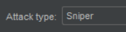

Burp attempts to automatically highlight possible fields of interest for Intruder, however, it doesn't have it quite right for what we'll be looking at in this instance. Hit 'Clear' on the right-hand side to clear all selected fields.

Next, let's highlight the email field between the double quotes ("). This will be whatever you entered in the email field for our previous failed login attempt.

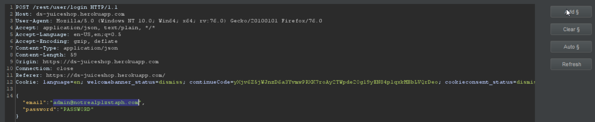

Now click 'Add' to select our email field as a position for our payloads.

Next, let's switch to the payloads sub-tab of Intruder. Once there, hit 'Load' and select the wordlist you previously downloaded in question five that is attached to this task.

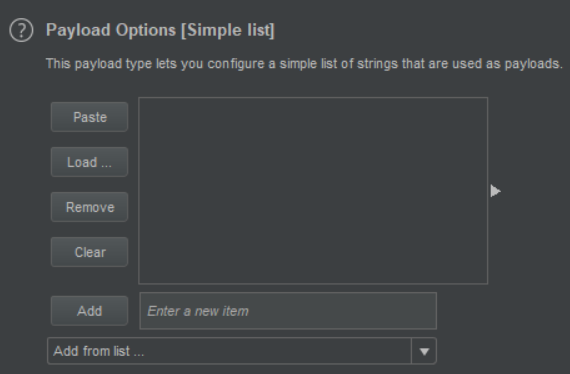

Almost there! Scroll down and uncheck 'URL-encode these characters'. We don't want to have the characters sent in our payloads to be encoded as they otherwise won't be recognized by SQL.

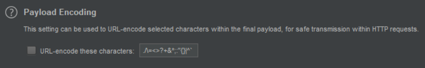

Finally, click 'Start attack'. What is the first payload that returns a 200 status code, showing that we have successfully bypassed authentication?

    a' or 1=1--

## Task 10 - As it turns out the machines are better at math than us

While not as commonly used in a practice environment, Sequencer represents a core tool in a proper web application pentest. Burp's Sequencer, [per the Burp documentation](https://portswigger.net/burp/documentation/desktop/tools/sequencer/getting-started), is a tool for analyzing the quality of randomness in an application's sessions tokens and other important data items that are otherwise intended to be unpredictable. Some commonly analyzed items include:

- Session tokens
- Anti-CSRF (Cross-Site Request Forgery) tokens
- Password reset tokens (sent with password resets that in theory uniquely tie users with their password reset requests)

We'll take a quick peek at how we can use Sequencer to examine the session cookies which Juice Shop issues.

Burp Suite reference documentation for Sequencer: [Link](https://portswigger.net/burp/documentation/desktop/tools/sequencer)

### Answer the questions below

Switch over to the HTTP history sub-tab of Proxy.

We're going to dig for a **response** which issues a cookie. Parse through the various responses we've received from Juice Shop until you find one that includes a 'Set-Cookie' header. 

Once you've found a request response that issues a cookie, right-click on the request and select 'Send to Sequencer'.

Change over Sequencer and select 'Start live capture'

Let Sequencer run and collect ~10,000 requests. Once it hits roughly that amount hit 'Pause' and then 'Analyze now'

Parse through the results. What is the effective estimated entropy measured in?

    bits

In order to find the usable bits of entropy we often have to make some adjustments to have a normalized dataset. What item is converted in this process?

    token

Read through the remaining results of the token analysis

## Task 11 - Decode and Compare

Decoder and Comparer, while lesser tools within Burp Suite, are still essential to understand and leverage as part of being a proficient web app tester. 

As the name suggests, Decoder is a tool that allows us to perform various transforms on pieces of data. These transforms vary from decoding/encoding to various bases or URL encoding. We chain these transforms together and Decoder will automatically spawn an additional tier each time we select a decoder, encoder, or hash. This tool ultimately functions very similarly to [CyberChef](https://gchq.github.io/CyberChef/), albeit slightly less powerful.

Similarly, Comparer, as you might have guessed is a tool we can use to compare different responses or other pieces of data such as site maps or proxy histories (awesome for access control issue testing). This is very similar to the Linux tool diff.

Per the Burp [documentation](https://portswigger.net/burp/documentation/desktop/tools/comparer), some common uses for Comparer are as follows:

- When looking for username enumeration conditions, you can compare responses to failed logins using valid and invalid usernames, looking for subtle differences in responses. This is also sometimes useful for when enumerating password recovery forms or another similar recovery/account access mechanism. 

- When an Intruder attack has resulted in some very large responses with different lengths than the base response, you can compare these to quickly see where the differences lie.

- When comparing the site maps or Proxy history entries generated by different types of users, you can compare pairs of similar requests to see where the differences lie that give rise to different application behavior. This may reveal possible access control issues in the application wherein lower privileged users can access pages they really shouldn't be able to.

- When testing for blind SQL injection bugs using Boolean condition injection and other similar tests, you can compare two responses to see whether injecting different conditions has resulted in a relevant difference in responses.

*These examples are taken nearly in their entirety from the Burp docs simply to provide a broader set of examples to consider when using Comparer.

Burp Suite reference documentation for [Decoder](https://portswigger.net/burp/documentation/desktop/tools/decoder) and [Comparer](https://portswigger.net/burp/documentation/desktop/tools/comparer)

### Answer the questions below

Let's first take a look at decoder by revisiting an old friend. Previously we discovered the scoreboard within the site JavaScript. Return to our target tab and find the API endpoint highlighted in the following request:

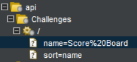

Copy the first line of that request and paste it into Decoder. Next, select 'Decode as ...' URL

What character does the %20 in the request we copied into Decoder decode as?

    space

Similar to CyberChef, Decoder also has a 'Magic' mode where it will automatically attempt to decode the input it is provided. What is this mode called?

    Smart Decode

What can we load into Comparer to see differences in what various user roles can access? This is very useful to check for access control issues.

    site maps

Comparer can perform a diff against two different metrics, which one allows us to examine the data loaded in as-is rather than breaking it down into bytes?

    words

## Task 12 - Installing some Mods [Extender]

Similar to adding mods to a game like Minecraft, Extender allows us to add components such as tool integrations, additional scan definitions, and more! Here are some of the most popular extensions I suggest checking out (not all of these are free but I suggest looking into them all the same):

* [Logger++](https://portswigger.net/bappstore/470b7057b86f41c396a97903377f3d81) - Adds enhanced logging to all requests and responses from all Burp Suite tools, enable this one before you need it ;)
* [Request Smuggler](https://portswigger.net/bappstore/aaaa60ef945341e8a450217a54a11646) - A relatively new extension, this allows you to attempt to smuggle requests to backend servers. See this talk by James Kettle for more details: [Link](https://www.youtube.com/watch?v=_A04msdplXs)
* [Autorize](https://portswigger.net/bappstore/f9bbac8c4acf4aefa4d7dc92a991af2f) - Useful for authentication testing in web app tests. These tests typically revolve around navigating to restricted pages or issuing restricted GET requests with the session cookies of low-privileged users
* [Burp Teams Server](https://github.com/Static-Flow/BurpSuite-Team-Extension) - Allows for collaboration on a Burp project amongst team members. Project details are shared in a chatroom-like format
* [Retire.js](https://portswigger.net/bappstore/36238b534a78494db9bf2d03f112265c) - Adds scanner checks for outdated JavaScript libraries that contain vulnerabilities, this is a premium extension
* [J2EEScan](https://portswigger.net/bappstore/7ec6d429fed04cdcb6243d8ba7358880) - Adds scanner test coverage for J2EE (java platform for web development) applications, this is a premium extension
* [Request Timer](https://portswigger.net/bappstore/56675bcf2a804d3096465b2868ec1d65) - Captures response times for requests made by all Burp tools, useful for discovering timing attack vectors 

A prerequisite for many of the extensions offered for Burp, we'll walk through the installation of Jython, the Java implementation of Python.

Burp Suite reference documentation for Extender: [Link](https://portswigger.net/burp/documentation/desktop/tools/extender)

Article on some of the top extensions for Burp Suite: [Link](https://portswigger.net/testers/penetration-testing-tools)

### Answer the questions bellow

To start, let's go ahead and switch over to the Options sub-tab of the Extender tab.

Scroll down until you reach the 'Python Environment' section. Note, Burp requires the standalone edition of Jython.

Download the standalone version of Jython from here: [Link](https://www.jython.org/download.html) - I suggest saving this or moving it to your Documents folder

Return back to Burp and hit 'Select file' under the Python Environment subsection for Jython standalone. Navigate to where you just downloaded this file and select it. 

Burp is now set to go for installing extensions. Switch to the BApp Store sub-tab of Extender and look through the various extensions offered.

Which extension allows us to bookmark various requests?

    Bookmarks

## Task 13 - But wait, there's more!

Before we conclude, let's take a quick look into the features that Burp Suite Professional offers: The Burp Suite Scanner and Collaborator Client!

Arguably the most powerful feature in Burp Suite, the Burp Suite Scanner allows us to passively and actively scan and spider the website we are testing for vulnerabilities. In Burp 2.0's task-based model, we can launch these scans (Scanner and Spider) from the dashboard and let them run in the background while we continue to examine the web app. In this case, I've run an unauthenticated scan against Juice Shop and have attached it to this task. [See this juiceshop-report file here](files/juiceshop-report.html). These reports can provide a starting place for further enumeration and exploitation via the other tools in Burp Suite.

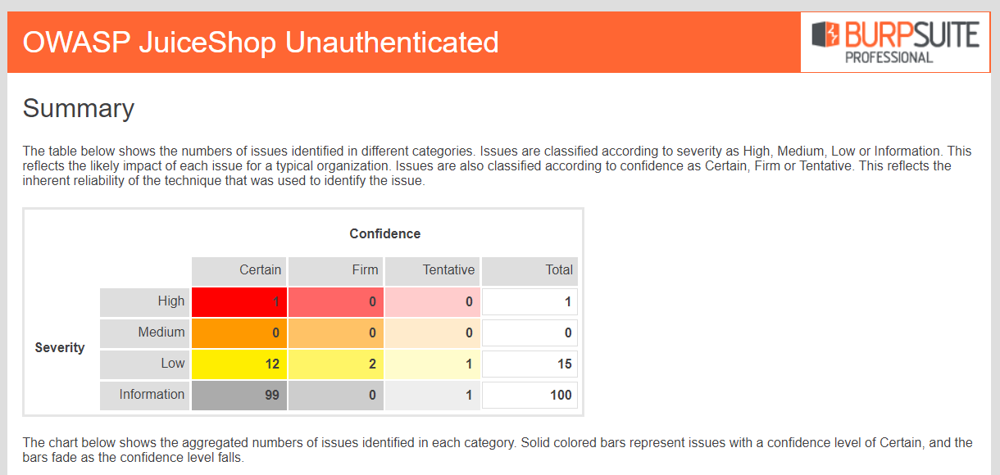

A Preview of the Report Attached to this Task Created with Burp Professional. [See this juiceshop-report file here](files/juiceshop-report.html).

Commonly used in manual tests, Burp Collaborator Client allows us to gain insight into issues that may otherwise seem to produce no output. Often during testing, we may come across items which, either due to timing/slowness of the web app or a lack of any reaction, are likely vulnerable but don't produce any sure-fire indicators. With Burp Collaborator, however, we can produce out-of-band alerts via generating payloads that reach back to Burp Suite's servers for us.

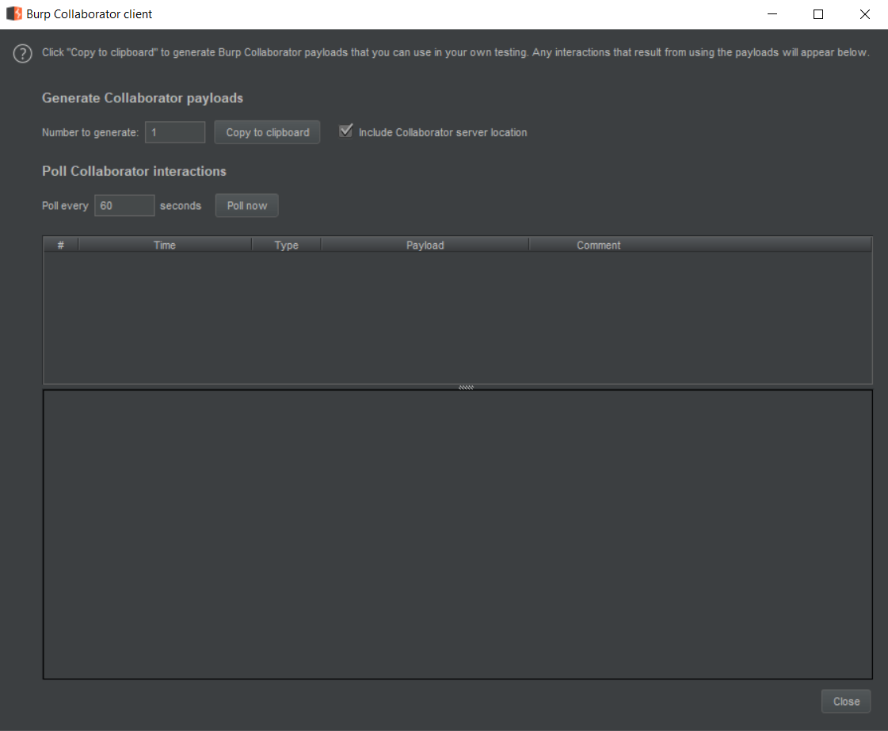

Burp Suite reference documentation for [Scanner](https://portswigger.net/burp/documentation/scanner) and [Collaborator Client](https://portswigger.net/burp/documentation/desktop/tools/collaborator-client)

### Answer the  questions below

Download the report attached to this task. What is the only critical issue? [See this juiceshop-report file here](files/juiceshop-report.html).

    Cross-origin resource sharing: arbitrary origin trusted

How many 'Certain' low issues did Burp find?

    12

## Task 14 - Extra Credit

Want to learn more? You're in luck! Port Swigger, the makers of Burp Suite, have a (mostly) free online Web Security Academy! This online training is excellent for learning more about web exploitation techniques and putting your newly minted Burp skills to the test! Pretty much all of this training is **free** with the only exceptions being a few labs that require the professional version of Burp Suite.

You can find the Port Swigger Web Security Academy training here: https://portswigger.net/web-security

In addition to Port Swigger's training, SANS offers excellent web application pentesting courses. A few of these include SANS [SEC 542](https://www.sans.org/course/web-app-penetration-testing-ethical-hacking) and [SEC 642](https://www.sans.org/course/advanced-web-app-penetration-testing-ethical-hacking). Note, these training courses are paid and can be fairly pricy. That being said, they are of incredibly high quality and are worth checking out. 

Last but not least, you can keep learning with OWASP Juice Shop in its room here on TryHackMe! [Link](https://tryhackme.com/room/owaspjuiceshop)

