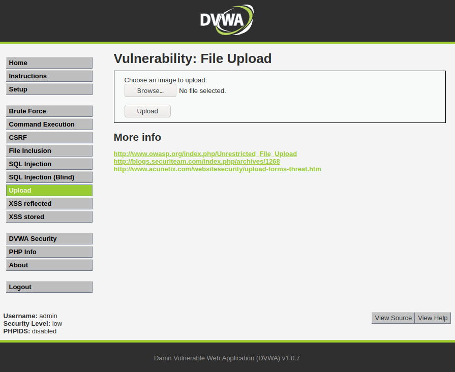
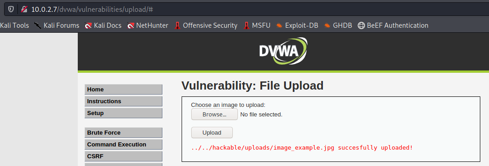
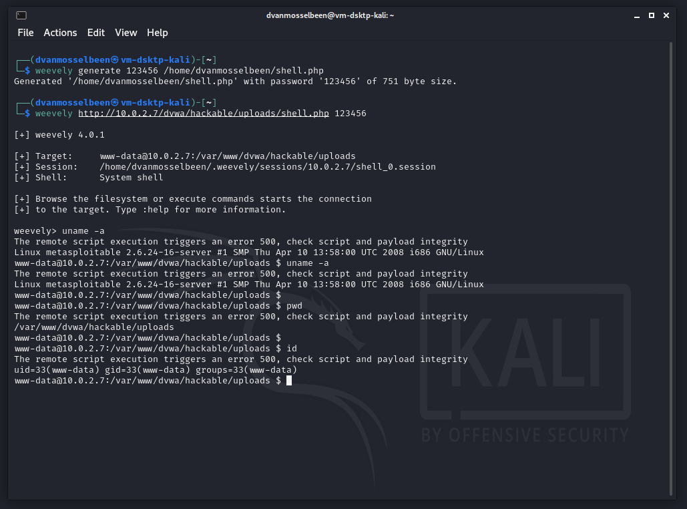

-----

* title: weevely
* description: This article is dedicated to weevely.
* created: 26-07-2021 09:30:00
* modified: 26-07-2021 09:30:00
* keywords: security, hacking, php, script, website, pentesting, hacking
* lang: en

-----

# Introduction

With the `weevely` tool you can easily abuse File Upload Vulnerabilities. 
With this tool you can easily create a PHP backdoor, if of course, the 
target server is using PHP and has some kind of File Upload Vulnerability.

More info here: https://github.com/epinna/weevely3 and check the 
documentation on the github wiki.

To resume:
    
    # Generate a PHP backdoor
    weevly generate [PASSWORD] [FILENAME]

    # Upload the PHP file to a vulnerable webserver

    # Connect to the backdoor system
    weevly [URL_BACKDOOR_PHP_FILE] [PASSWORD]

    # You have access to the backdoor, use help for help
    help

The `Damn Vulnerable Web App!` (`DVWA` for short) is a good place to try out 
`weevly`.  For instance, on the `DVWA` upload section is a good try out. 
Remember that the default username is `admin` and the password is `password` 
for `DVWA`.

For the example shown here, note that the `DWA Security` level need to be 
set to `low` for this to work. By default, it is set to high. However, when set to 
high, rename the script and add `jpg` behind the `php` extension and upload it as 
`shell.php.jpg`. You can adjust the security level in the left menu. The 
website checks for the file extensions, but the backend system allows us to 
still execute the `php` file even if it has the `jpg` extension.

The testing part is here:

http://10.0.2.7/dvwa/vulnerabilities/upload/

There you can first try out to upload an image as they expect image upload 
only, select an image and press the `upload` button.

Which result in:

The interesting part in the upload information result is this path 
information `../../hackable/uploads/image_example.jpg` which should be never 
displayed. We can see that the image has been uploaded 2 directories higher, 
and then in the directory `/hackable/uploads/`.

If we look to the URL which is http://10.0.2.7/dvwa/vulnerabilities/upload/#, 
we can now try to go on http://10.0.2.7/dvwa/hackable/uploads/image_example.jpg 
to see if the image is accessible. And we you can see, the image is been 
accessible.

So let's try to upload a PHP backdoor by making use of `weevely` to generate 
our `php` script which will allow us to have shell access on the website. 
For this in a console type the following:

Syntax is as following:

    weevly generate [PASSWORD] [FILENAME]

Example:

    weevely generate 123456 /home/itchy/shell.php

Go back to the `DVWA` website, and in the upload section upload that 
`shell.php` file. 

When we go to the link http://10.0.2.7/dvwa/hackable/uploads/shell.php
we will see a blank page, but not a `404` or any other error message. So all 
fine so far.

Now we can try to obtain some shell with the following command:

    weevely http://10.0.2.7/dvwa/hackable/uploads/shell.php 123456

You will get a shell access and will be able to do whatever we want:

*Note that there's some error in the shell but it does work fine: 

    The remote script execution triggers an error 500, check script and payload integrity*

*I have created a bug report for the little error message we see 
on screen https://github.com/epinna/weevely3/issues/151*

Press `ctrl+c` to get out of the backdoor shell.
