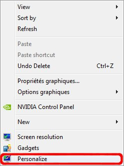
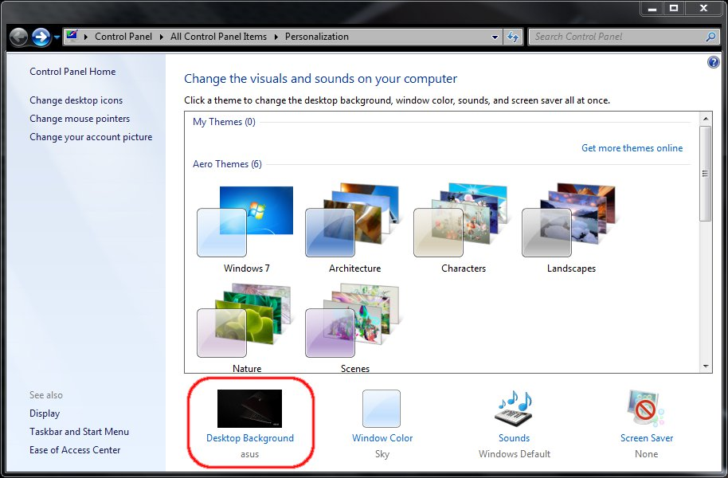
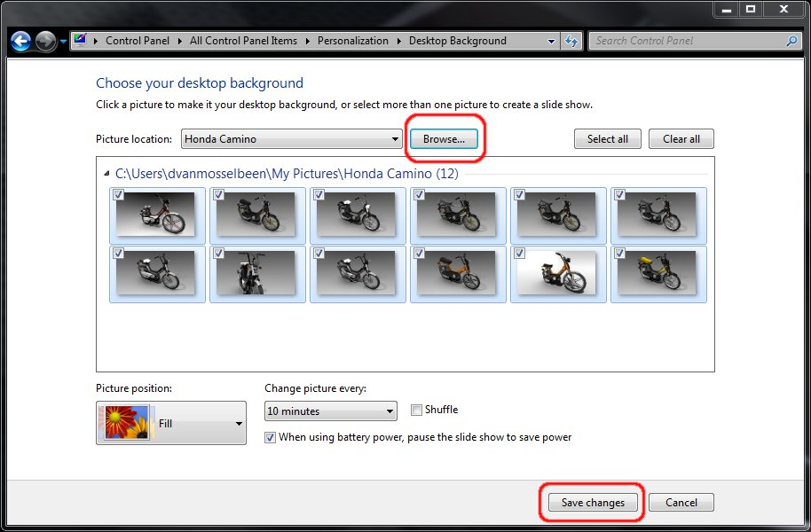
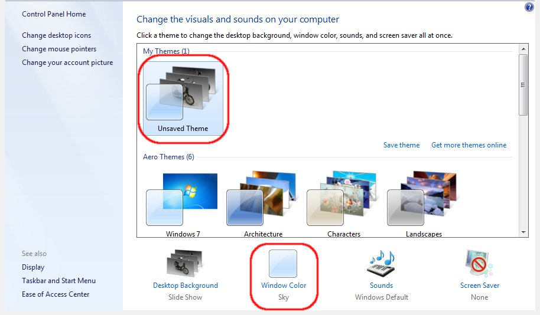
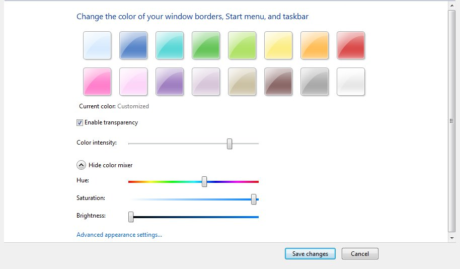

# Create a Windows 7 theme pack

*In this article i will detail how one could easily create a Windows 7
theme that can be shared and installed by other peoples. You don\'t need
any fancy tools to create a Windows 7 pack. Nor do you need to have any
technical knowledge.*

With Windows 7 you can easily create a nice custom theme with some
slideshow wallpaper system. You can customize the window class color and
even the sound theme. Themes are downloadable from the Microsoft website
as well as other locations of the Internet. Installing a Windows 7 theme
is a matter of double clicking a theme file!

**IMPORTANT NOTE**: If you wish to share a Windows theme pack. Make sure
your don\'t violate any copyright by including some wallpapers, sound
files of whatever you don\'t own rights for.

**Requirements**: A few wallpapers you want to include in your theme
pack. Optionally a few custom sound files.

Firstly start by organisating the data you go to use.
Somewhere on your computer create a new directory which will hold all
the wallpapers we plan to include in the theme pack. For this little
article, we go to create a directory named **Honda Camino wallpapers
themepack**. There in copy the wallpapers. Optionally, if you plan to
share sound files, do the same as done for the imagery.

Right click on you desktop and in the context menu select
**Personalize**.

height="332"}Desktop context menu

In the new window that has poped up there you might
adjust the settings you want. Look at the bottom of the screen where you
can click on a few items. Firstly start by clicking on **Desktop
background**, a new window will pop up.

Browse to the location which hold your imagery you want
to use as backgrounds (wallpapers). You will see a preview of all
wallpapers bellow. By default, all images in that directory will be
included/activated in the theme pack. You can uncheck the undesired
images if you want. See also the few options bellow in the screenshot.

After having pressed the Save changes buton, you will
come back to the first screen of the personalisation window. You will
now see that there\'s a new entry **Unsaved Theme**. But first, let\'s
change a few more options\...

Let's now change the Window Color. Press the **Window
Color** button as shown in the previous window. In the next screenshot
we already adjusted the colors to our taste. Here i made the color kinda
dark. Once your colors adjusted press the **Save changes** button.

We come again back to the main Personalisation window as
show in point **5**. We could also adjust the sound settings but i
won\'t handle this. I don\'t have any decent sound file for this sort of
things. Instead we will now save our theme to a file. For this, with the
right mouse button on the **Unsaved Theme** and in the context menu
select **Save theme**. In the little dialog that pop up, give the theme
a name. I gave it the name Honda Camino. Now you can right click on the
it and in the context menu select **Save theme for sharing**. A clasic 
Save As window will pop up where you can define the location and the
name of the theme file.
