# CYGWIN

## Table of Contents

- [Introduction](#introduction)
- [Installation](#installation)
- [Recommended apps to install](#recommended-apps-to-install)
- [App specific things](#app-specific-things)
  - [openssh](#openssh)
- [Resources](#resources)

## Introduction

`Cygwin` is a large collection of `GNU` and `Open Source` tools which provide functionality similar to a Linux distribution on `Windows`. A `DLL` (`cygwin1.dll`) which provides substantial `POSIX API` functionality.

## Installation

Download the `cygwin` installer and execute it. Then it's a matter to follow the instructions on the screen.

**Note, once everything installed, I recommend keeping this installer, as if you want to install other tools, you need to re-run this same installer.**

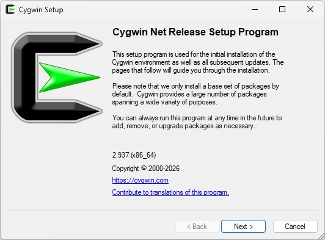

Chose a download source.

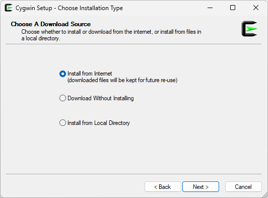

Select where you want to install the Cygwin files and if all users should be allowed to use it. The default settings are good.

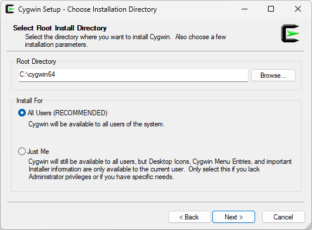

Select Local Package Directory. This should be maybe at `C:\Users\<USERNAME>\Download` so that it is not on the `Desktop`.

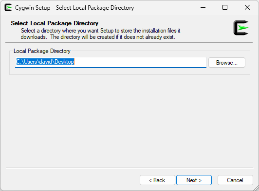

Probably we do not need to specify proxy settings.

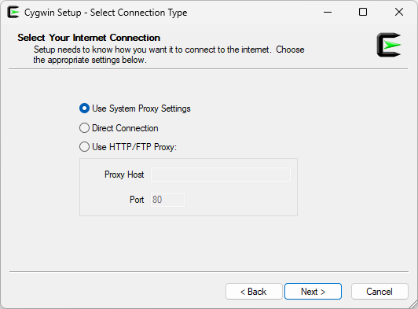

Chose a download mirror close to your place. It does not matter which one you select, but it can affect the download speed of the package you download.

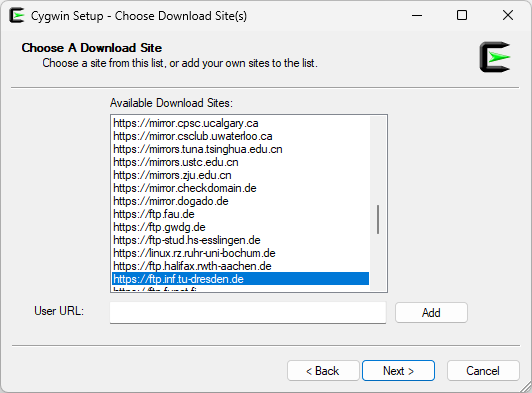

In this software list, I only have selected `openssh` and in the dropdown the highest number, which was `10.5p1-1`.

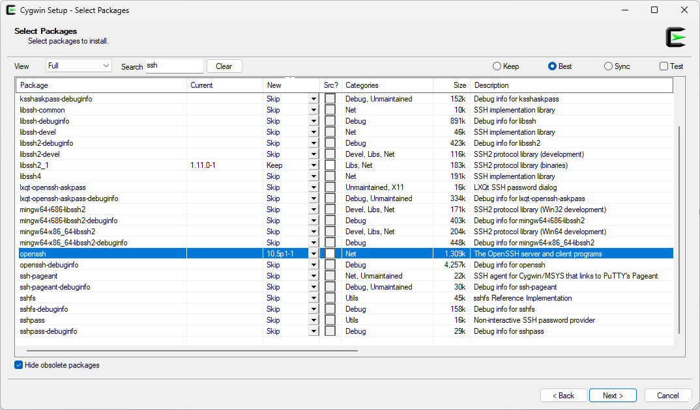

The installer inform us what will be installed.

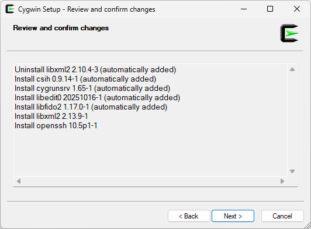

The installer now need to download the required things.

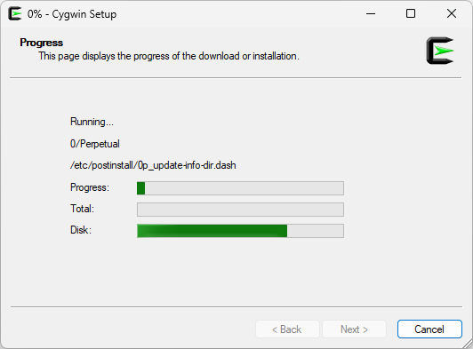

On the final page, I have selected the 2 options, "Create Icon on Desktop" and "Add icon to Start Menu". Then pressed the Finish button.

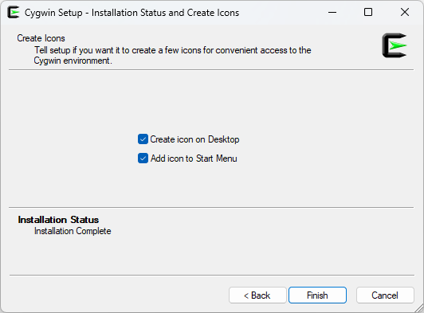

On the desktop we now have a shortcut called `Cygwin64 Terminal`. Double-clicking on it will start the `cygwin` terminal. We can now try to connect with `ssh` to a remote host.

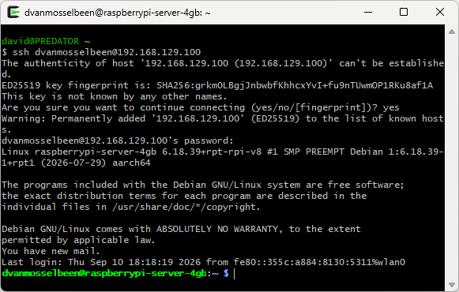

We can easily have a list of the installed apps with `cygwin`. For this, select the option `Picked` the in the view list like shown on the following screenshot. Note that this does not show all the apps installed, but these we have chosen to install. To have the full list (with dependencies etc) select the option `Up To Date` in the `view` list.

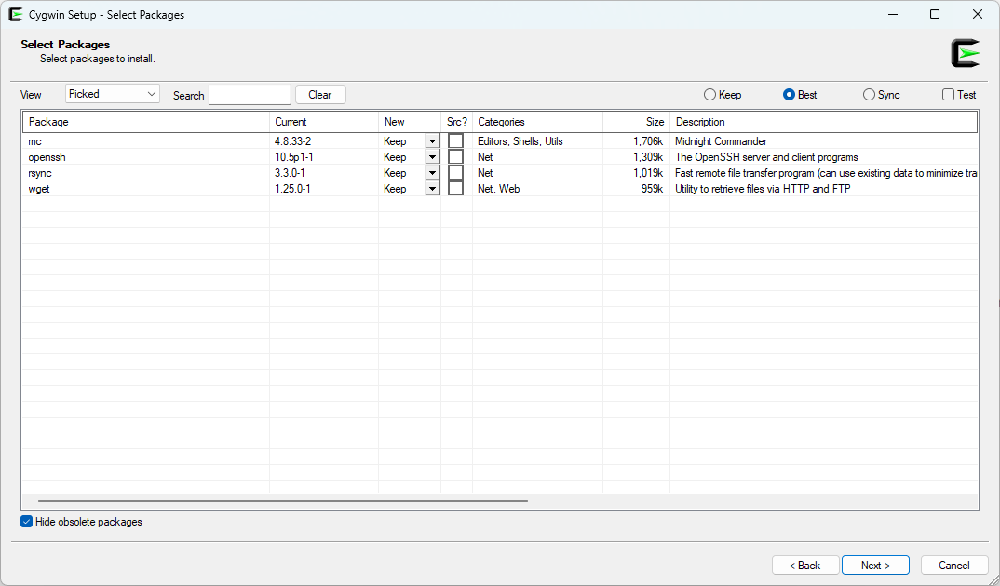

## Recommended apps to install

This is all up to you, what you need or plan to use. Note that there is a lot of other (dependencies) files installed as well as the base tools.

````text
mc
openssh
rsync
wget
````


## App specific things

Some things could be slightly different on a Microsoft Windows system. Some other configuration are exactly the same as on a classic `GNU / Linux` system.

### openssh

To make ssh keys on this system, so that you can do a remote ssh connection to a remote host, is exactly the same procedure as on a GNU / Linux machine.

## Resources

- <https://cygwin.com/> - The official website of `Cygwin`.

