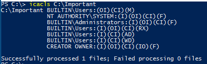
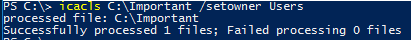
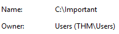

# Using the cli on Microsoft Windows

This article talk about command line interface tips and tricks on a Microsoft
Windows operating system. Yah, the cli of Microsoft Windows isn\'t that
complex as it is in many other operating systems. Nor are there many
tools to make you pleasant in your cli. Microsoft just see all graphical
user interfaces everywhere.

This article will just resume a few things, it can\'t be complete nor
detail every aspect of the command line interface. Many cool command
line tools needs to be installed separately. Like for example these
tools Sysinternal offer.

## Getting started

To get started, you need to open that Command DOS interface. By going
into the `Start menu > Execute`, or simply by pressing the
shortcut key window+r and then following by entering **cmd** and
confirming by pressing the **Ok** button. This will pop up some black
windows.

If you messed with your user setting, it could be that the cmd just
launch in full screen mode. This can be useful on other operating
system, but honesty, it isn\'t on a Microsoft Windows box.

## Some applications

There isn't that many of cool command line interface programs. Most of
the administration needs to be done throught graphical user interface.
Which is ok to do for a basic user. But sometimes you just want to get a
shell with all it\'s power. This for several reasons such as remote
administration but especially for scripting purpose.

## icacls

Tool to check files or folder permissions.

Let's explain what those letters in parentheses mean as right now you might be confused.

* `I` - permission inherited from the parent container
* `F` - full access (full control)
* `M` - Modify right/access 
* `OI` - object inherit 
* `IO` - inherit only 
* `CI` - container inherit 
* `RX` - read and execute 
* `AD` - append data (add subdirectories)
* WD - write data and add files

You can use icacls to check permissions, set ownership of the folder, set, remove or deny permissions. An example would be setting the ownership of the folder to Users.

To check if that applied you can right-click on the folder and select "Properties", go to the "Security" tab, and click on "Advanced". There you should be able to see that the owner is "Users".

## Netstat

    netstat –a -b

## See the members of a group

    net group <some-group-name> /domain

## See user related info

    net user <username> /domain

## Force the group policy

    gpupdate /force

## Ohter

* `net` - primarily used to manage network resources

## See also

* The my note file [Miscrosoft Windows 10](microsoft-windows-10.md) which contains lot's of commandline tools and information. Both files should be merged at some point.
* 